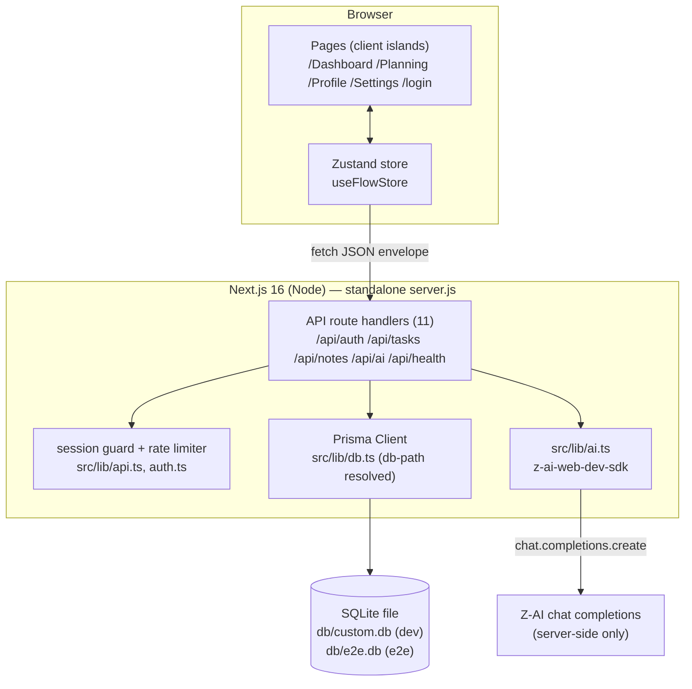
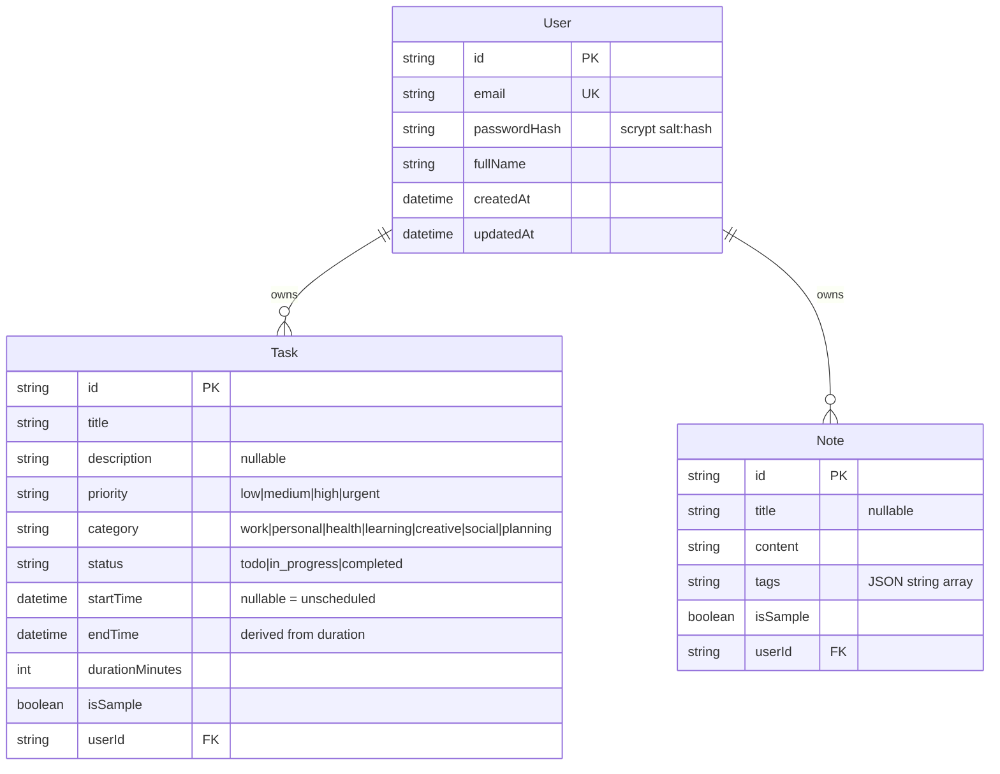

# FlowSchedule — Master Project Architecture Document (PAD) v1.0

**Classification:** Internal Engineering Reference
**Status:** DEFINITIVE, PRODUCTION-LOCKED BLUEPRINT
**Companion Documents:** `README.md` (onboarding), `AGENTS.md` (agent operating contract), `CLAUDE.md` (Claude Code conventions), `docs/Tailwind-V4-Validation-Report.md` (trap taxonomy)
**Last Updated:** 2026-10-05
**Audience:** Senior Engineers, Tech Leads, DevOps, and Onboarding Engineers
**Rule:** Every architectural decision in this document traces to a specific rationale. Nothing is here "because it's popular."

---

#### Revision Block — v1.0 (Tracked Changes)

- `[AUTH]` Initial as-built PAD for the FlowSchedule clone, generated after the full verification gate ran green (lint, tsc, 44/44 unit, build, 29/29 e2e). Session-1 remediation additions: site metadata layer (`src/lib/site.ts`, `/sitemap.xml`, `/robots.txt`, `metadataBase`), `.env.example` contract tests, e2e determinism hardening — see `docs/session_1-review.md` (build narrative: `docs/session_1.md`).
- `[SYN]` Reference-app facts (routes, enums, geometry, gradients, prompts) were extracted from the deployed reference's compiled bundle and live DOM — measured, not guessed.
- `[CA]` The five Tailwind v4 traps in §5.4 are applied as code-level mitigations, each traced to `docs/Tailwind-V4-Validation-Report.md`.

---

## Table of Contents

1. [System Overview & Decisions](#1-system-overview--decisions)
2. [High-Level System Topology](#2-high-level-system-topology)
3. [Application Architecture](#3-application-architecture)
4. [Data Architecture](#4-data-architecture)
5. [Design System Reference](#5-design-system-reference)
6. [Security Architecture](#6-security-architecture)
7. [AI Integration Architecture](#7-ai-integration-architecture)
8. [Testing Strategy](#8-testing-strategy)
9. [Build & Deployment](#9-build--deployment)
10. [Developer Handbook](#10-developer-handbook)
11. [Known Issues & Deferred Work](#11-known-issues--deferred-work)
12. [Verification Ledger](#12-verification-ledger)

---

## 1. System Overview & Decisions

### 1.1 Document Metadata & Purpose

FlowSchedule is a faithful, self-hosted clone of the FlowSchedule reference
app (a base44-built weekly schedule planner). This PAD is the single
source of truth for the clone's architecture: read it before extending,
debugging, or replicating the system. New engineers should read §1–§5
first; debugging starts at §10 (the handbook) and the trap taxonomy in
§5.4; reviewers of tech choices start at §1.3 (the ADRs).

The product surface: a **weekly time-grid calendar** (16 hour slots
07:00–22:00 × 7 days), a **weekly planning** view with day columns and
statistics, **four quick-action panels** (quick task add, focus timer,
activity log, notes brainstorm), and **two LLM-backed sidebar cards**
(daily focus quote, AI schedule summary).

### 1.2 Technology Stack Summary

| Layer | Technology | Version | Key Rationale |
|---|---|---|---|
| Web framework | Next.js (App Router, Turbopack) | 16.x | Real-file routes at the reference's exact paths; API route handlers for the typed JSON layer; standalone output for deploys |
| UI runtime | React | 19.x | The only runtime Next 16 supports; client components for the interactive islands |
| Language | TypeScript | 5.x (strict) | Typesafety across the store/API/Prisma seams |
| Styling | Tailwind CSS | 4.x (CSS-first) | The reference's utility vocabulary; `@theme` tokens with v3 values pinned (see §5.4) |
| Animations | tw-animate-css | 1.4.x | The v4-native port of tailwindcss-animate — powers the Radix enter/exit utilities (.animate-in, fade/zoom/slide) the reference's stylesheet defines (session 8, G-1) |
| Component primitives | Radix (shadcn-style) | latest | Accessible Dialog/Select/DropdownMenu/Accordion — focus trap, Escape, and ARIA for free |
| Charts | recharts | 2.15.x | The Skills Map pie — the reference's MEASURED major (its bundle's pie DOM has no recharts-zIndex layers; session 7, G-3, e2e-pinned) |
| Icons | lucide-react | 0.475.x | The reference's MEASURED version (its bundle banner: v0.475.0, single-class emission; session 8, G-2, e2e-pinned) |
| Motion | framer-motion | 14.x | The reference's three drifting background blobs |
| Client state | Zustand | 5.x | Single store, envelope unwrapping, no server-state caching layer needed |
| ORM | Prisma | 6.x | Schema-as-code, SQLite-first with a PostgreSQL escape hatch |
| Database | SQLite | — | Zero-config self-hosting; one file, CLI+runtime path resolution seam (§4.3) |
| LLM | z-ai-web-dev-sdk | 0.0.x | Server-side chat completions for the two AI cards; deterministic fallbacks |
| Unit tests | Vitest | 5.x | Fast pure-seam suites (crypto, constants, path resolution) |
| E2E tests | Playwright | 1.6x | Trusted pointer events (required for Radix), production-standalone target |
| Runtime | Bun | 1.3+ | Dev server, seed execution, standalone prod server |

### 1.3 Architecture Decision Records (ADRs)

**ADR-001: Real Next.js routes instead of a single-page app with rewrites**

- **Context:** The reference is a React Router SPA with path-based views
  (`/Dashboard`, `/Planning`, `/Profile`, `/Settings`); the scaffold's
  previous occupant (ORBITAL) used one page + `next.config.ts` rewrites to
  emulate it.
- **Decision:** FlowSchedule's views are real App Router route folders,
  named with the reference's exact capitalization, inside an `(app)`
  route group with a shared client layout. `/login` is standalone.
- **Rationale:** Four real pages make server-side metadata, per-route
  code splitting, and direct navigation work natively; the SPA-rewrite
  machinery exists to emulate what App Router already provides. The
  capitalized folder names keep the URLs byte-identical to the reference
  (links, bookmarks, and the e2e URL assertions depend on it).
- **Consequences:** Slightly more files; no History-API sync code to
  maintain; deep links are real.
- **Alternatives Rejected:** single page + rewrites (ORBITAL pattern —
  more machinery, same UX); lowercase routes (breaks reference parity).

**ADR-002: Cookie-session auth (scrypt + HMAC tokens) instead of an auth library**

- **Context:** The reference delegates auth to the base44 platform
  (opaque to a self-hosted clone). The scaffold has no NextAuth/Better-Auth
  dependency.
- **Decision:** Hand-rolled sessions: scrypt password hashes
  (`salt:hash`), HMAC-SHA256-signed tokens (`userId.expiry.mac`) in an
  HttpOnly `fs_session` cookie, 30-day TTL, `timingSafeEqual`
  verification; per-IP fixed-window login/register rate limiting.
- **Rationale:** Zero new dependencies; the full auth surface is ~100
  auditable lines; timing-safe comparisons and salted scrypt are the
  load-bearing security properties; the ORBITAL predecessor validated
  this exact pattern in production.
- **Consequences:** No OAuth (the "Continue with Google" button renders
  an explanatory notice — parity without credentials); password reset is
  an admin action.
- **Alternatives Rejected:** Better-Auth (adds DB session rows + provider
  config for a two-role single-user app); NextAuth v5 (OAuth-first, no
  email/password focus).

**ADR-003: Zustand store as the single API client (no RSC data layer)**

- **Context:** The reference is a client SPA where every view fetches
  through a platform SDK; the clone's pages are interactive (calendar
  geometry, panels, timers) and need fine-grained client state anyway.
- **Decision:** One client store (`useFlowStore`) owns user/tasks/notes
  and wraps every `/api/*` call, unwrapping the
  `{ ok, data } | { ok, error }` envelope. Server components only render
  shells; entity data never flows through RSC props.
- **Rationale:** Mirrors the reference's data-flow shape (component →
  store → API → DB), keeps mutations and optimistic-ish refresh in one
  place, and avoids a parallel RSC query layer that would immediately be
  bypassed by the interactive components.
- **Consequences:** Authenticated pages load data client-side after
  mount (skeletons cover it — the reference behaves identically); the
  store's mapper functions are the only snake/camelCase seams.
- **Alternatives Rejected:** RSC + Server Actions (the interactive
  calendar would need a parallel client cache anyway); React Query
  (extra dependency for five endpoints).

**ADR-004: Tailwind v4 with the v3-era token values pinned in `@theme inline`**

- **Context:** The reference compiles with Tailwind v3-era semantics; v4
  changes default palette (oklch drift), shadow scale (one-notch shift),
  gradient interpolation (oklab), space-y selector (side + specificity),
  and silently drops bare-HSL theme triplets under `@theme inline`.
- **Decision:** `src/app/globals.css` pins: full `hsl()` semantic tokens
  (Trap 1), the v3 hex palette (Trap 2), `--shadow-sm: 0 1px 2px 0
  rgb(0 0 0 / 0.05)` (Trap 5), a `cursor: pointer` base rule for buttons
  (v4 preflight omits it), and a repo-wide prohibition on `space-y-*`
  containers with mt/mb-carrying children (Trap 4). Quick Action
  gradients ship as inline-style hex gradients (Trap 3 — the reference's
  own form).
- **Rationale:** `docs/Tailwind-V4-Validation-Report.md` documents all
  five traps with production evidence; pinning tokens preserves computed
  parity with the reference while using the v4 engine.
- **Consequences:** globals.css is append-only in spirit — refactors must
  re-verify §5.4; the mobile-menu geometry spec guards Trap 4.
- **Alternatives Rejected:** downgrading to Tailwind v3 (loses v4
  CSS-first and the scaffold's toolchain); accepting v4 defaults
  (visibly drifts from the reference).

**ADR-005: LLM server-side only, with deterministic fallbacks**

- **Context:** The reference calls a platform `InvokeLLM` endpoint with
  JSON schemas; a self-hosted clone must own that call and survive SDK
  outages/rate limits (observed: 429s during the e2e run).
- **Decision:** `src/lib/ai.ts` wraps `z-ai-web-dev-sdk` chat
  completions for the two AI surfaces (daily focus quote; schedule
  summary) — server-side only, exact reference prompts, defensive JSON
  extraction, typed guards, and canned fallbacks on any failure path.
- **Rationale:** The reference's own catch blocks ship fallback content
  ("Could not fetch dynamic focus data, using default") — mirroring it
  keeps the dashboard render total (verified: e2e passed through live
  429s).
- **Consequences:** AI content varies run-to-run (both valid in tests);
  SDK errors log `[ai] … using default` — informational, not incidents.
- **Alternatives Rejected:** client-side SDK use (exposes credentials,
  breaks the reference's server-side shape); no AI (drops a headline
  feature).

**ADR-006: Playwright against the production standalone build**

- **Context:** E2E must catch build-output-only failures (Tailwind token
  generation, standalone bundling) and needs trusted pointer events for
  Radix menus.
- **Decision:** `playwright.config.ts` boots `.next/standalone/server.js`
  on `:3100` with an isolated seeded `db/e2e.db`; a setup project signs
  the demo user in once and shares storageState (login is rate-limited).
- **Rationale:** Dev-server e2e hides production CSS/bundling bugs;
  per-test logins trip the rate limiter; one worker keeps the shared
  SQLite file consistent.
- **Consequences:** `bun run build` is a precondition; the suite is
  slower to boot but hermetic.
- **Alternatives Rejected:** dev-server e2e (misses prod-only defects);
  parallel workers (SQLite contention).

---

## 2. High-Level System Topology



- **Browser layer**: React 19 client components; Zustand store is the
  only fetcher; Radix portals for menus/dialogs; framer-motion blobs.
- **Application layer**: Next.js App Router — static pages + dynamic API
  route handlers; every handler runs the session guard before touching
  Prisma.
- **Data layer**: Prisma 6 over SQLite (dev/e2e) or PostgreSQL
  (`DATABASE_URL` swap; schema provider change).
- **External services**: the z-ai SDK (LLM) — the only outbound call;
  failures degrade to defaults, never bubble.

---

## 3. Application Architecture

### 3.1 The Layer Model (the Golden Rule)

Classify every request by exactly ONE layer before writing code:

```
Layer 0: Pages/Routes — src/app/**. Real route folders ((app)/ root
         dashboard, Dashboard, Planning, Profile, Settings; login;
         not-found) — the (app) layout is a server-side session guard
         (no valid cookie → redirect /login). Rule: pages render shells
         + client islands; no entity fetching here.
Layer 1: Client islands — "use client" components (layout/, dashboard/,
         planning/) + the Zustand store. Rule: ALL entity data flows
         through the store's envelope-unwrap; components never fetch
         /api/* directly.
Layer 2: API route handlers — src/app/api/**. Rule: validate input
         (domain guards + manual checks), enforce the session, return
         ok()/fail() — never throw, never leak internals.
Layer 3: Domain/lib seams — src/lib/{auth,api,domain,ai,db,db-path}.ts.
         Rule: pure, unit-testable logic; the ONLY places that know
         crypto, enums, geometry, LLM prompts, or DB URLs.
```

Dependency direction: `L0 → L1 → L2 → L3`; `L3` never imports upward.
`src/lib/domain.ts` is the single enum/constant source — duplicating its
values in components is a defect.

### 3.2 Annotated Directory Structure

```
src/
├── app/
│   ├── layout.tsx                  # Root: metadata, viewport, body
│   ├── not-found.tsx               # The reference's custom 404 (session 5)
│   ├── globals.css                 # Tailwind v4 @theme + 5 trap pins (§5.4)
│   ├── (app)/                      # Session-guarded group (server guard in layout)
│   │   ├── layout.tsx              # getSessionUser() → redirect(/login) + AppShell
│   │   ├── page.tsx                # "/" — the dashboard root (the reference's landing)
│   │   ├── Dashboard/page.tsx      # "/Dashboard" — thin wrapper over DashboardView
│   │   ├── Planning/page.tsx       # Week cards + click-to-select day panel (decompiled reference behavior: selectedDay starts null, static Day Statistics placeholder, decorative Filter)
│   │   ├── Profile/page.tsx        # Static preference cards
│   │   └── Settings/page.tsx       # Theme/Dark/Language/Performance cards
│   ├── login/page.tsx              # Suspense-wrapped auth views: sign-in /
│   │                               # sign-up / forgot / reset-sent (session 5)
│   └── api/
│       ├── auth/login|register|me  # Cookie-session endpoints
│       ├── logout/                 # Cookie clear
│       ├── tasks/ + tasks/[id]/    # CRUD, enum-validated, ownership-scoped
│       ├── notes/ + notes/[id]/    # CRUD, tags JSON-array
│       ├── ai/daily-focus|summary  # LLM + fallbacks (ADR-005)
│       └── health/                 # Liveness + DB probe
├── components/
│   ├── ui/                         # shadcn primitives (button, dialog,
│   │                               # select, dropdown-menu, accordion, …)
│   ├── layout/
│   │   ├── AppShell.tsx            # Store bootstrap + gradient canvas
│   │   ├── Header.tsx              # THE mobile menu + desktop dropdown (§5.5)
│   │   └── BackgroundBlobs.tsx     # framer-motion drifting blobs
│   ├── dashboard/
│   │   ├── WeeklySchedule.tsx      # 80px+16×60px grid, 1px/min blocks
│   │   ├── QuickActions.tsx        # 4 tiles + decompiled panels (G1e/z1e/
│   │   │                           # W1e/H1e/K1e: gradient card morph,
│   │   │                           # expanding overlay, per-panel views)
│   │   ├── SkillsMap.tsx           # recharts pie + center total
│   │   ├── StatusCard.tsx          # All-caught-up / Up Next
│   │   ├── DailyFocusCard.tsx      # LLM quote card
│   │   └── AISummaryCard.tsx       # LLM summary card (derived loading)
│   └── planning/
│       └── TaskDialog.tsx          # Add/Edit form (remount-reset pattern)
├── lib/
│   ├── auth.ts                     # scrypt + HMAC + session helpers
│   ├── api.ts                      # ok/fail envelope, rate limit, guard
│   ├── domain.ts                   # enums, geometry, color maps (measured)
│   ├── ai-defaults.ts              # shared AI fallback content (client-safe, unit-pinned)
│   ├── ai.ts                       # LLM wrappers + fallbacks
│   ├── db.ts / db-path.ts          # Prisma singleton + URL resolution seam
│   └── utils.ts                    # cn()
└── store/
    └── useFlowStore.ts             # The API client + mappers
prisma/
├── schema.prisma                   # User/Task/Note (reference entity shapes)
└── seed.ts                         # Idempotent (is_sample guards)
tests/
├── auth.test.ts / domain.test.ts / db-path.test.ts   # Vitest unit
└── e2e/                            # Playwright (production target)
    ├── mobile-navigation.spec.ts   # THE mobile-menu pin (§5.5)
    ├── auth.spec.ts / dashboard.spec.ts / planning.spec.ts
    ├── auth.setup.ts               # Single sign-in → storageState
    └── global-setup.ts             # db/e2e.db push + seed
```

### 3.3 Critical Code Patterns

**Pattern 1 — the API envelope (every route handler)**

```ts
// src/app/api/tasks/route.ts (excerpt)
export async function POST(req: Request) {
  const auth = await requireUser();            // session guard FIRST
  if ("response" in auth) return auth.response; // 401 envelope
  const body = await readJson(req);
  const title = typeof body.title === "string" ? body.title.trim() : "";
  if (!title) return fail("VALIDATION", "Task title is required.");
  const priority = isPriority(body.priority) ? body.priority : "medium"; // enum guard
  const task = await db.task.create({ /* … */ });
  return ok({ task }, 201);
}
```

*Why:* the `{ ok, data } | { ok, error }` contract lets the store unwrap
uniformly and keeps errors typed and customer-safe. The guard-first
ordering means no handler logic runs unauthenticated.

**Pattern 2 — derived loading state (no effect-body setState)**

```ts
// src/components/dashboard/AISummaryCard.tsx (excerpt)
const dayKey = format(day, "yyyy-MM-dd");
const [result, setResult] = useState<{ day: string; summary: AiSummary } | null>(null);
const loading = !result || result.day !== dayKey;   // DERIVED
useEffect(() => {
  let cancelled = false;
  (async () => {
    const next = await fetchSummary(dayKey);        // await FIRST
    if (!cancelled) setResult({ day: dayKey, summary: next });
  })();
  return () => { cancelled = true; };
}, [dayKey]);
```

*Why:* `react-hooks/set-state-in-effect` is an ERROR in this repo — it
caught real cascading-render bugs. The keyed-result shape resets loading
implicitly when the day changes, with zero synchronous setState.

**Pattern 3 — form reset by remount (TaskDialog)**

```tsx
// src/components/planning/TaskDialog.tsx (excerpt)
export function TaskDialog({ open, onOpenChange, editing, initial }) {
  return (
    <Dialog open={open} onOpenChange={onOpenChange}>
      <DialogContent>
        <TaskFormBody editing={editing} initial={initial} onOpenChange={onOpenChange} />
      </DialogContent>
    </Dialog>
  );
}
function TaskFormBody({ initial, /* … */ }) {
  const [form, setForm] = useState(initial);   // fresh per open-session
  // …
}
```

*Why:* Radix mounts `DialogContent`'s children only while open — the body
re-mounts each session, so `useState(initial)` seeds fresh values with no
reset effect and no stale-form bug.

**Pattern 4 — measured geometry as constants (the calendar)**

```ts
// src/lib/domain.ts (measured from the reference bundle)
export const CALENDAR_HOURS = Array.from({ length: 16 }, (_, i) => i + 7); // 07:00–22:00
export const CALENDAR_LABEL_WIDTH = 80;
export const CALENDAR_SLOT_WIDTH = 60;   // → PX_PER_MINUTE = 1

// WeeklySchedule task block: left = minutesSince07:00 × 1px, width = max(duration, 10px)
```

*Why:* hardcoding the measured constants (not deriving them from
"responsive" abstractions) is what keeps task blocks at byte-identical
positions; the unit tests pin the 60px/60min identity.

---

## 4. Data Architecture

### 4.1 Database Schema



The shapes mirror the reference app's entities exactly (Task with
`start_time`/`duration_minutes`/`end_time`, Note with `tags` array, User)
— the field names corroborated by the reference's bundle (its TaskDialog
state initializes `{start_time:"", end_time:"", duration_minutes:60}`;
`fn.Note.list("-created_date")`; notes' tags consumed as an array) and,
since session 12, by the **CAPTURED live wire** (XHR interception of the
reference's own base44 entity traffic): responses carry
`created_date`/`updated_date`/`is_sample`/`created_by` (the author's
email)/`created_by_id` — 14 keys for Task, 9 for Note. The wire format
is the captured entity shape in BOTH directions — requests accept
`start_time`/`duration_minutes` and the dialog's client-computed
`end_time` (its decompiled f function: end = start + duration*60000)
with the description VERBATIM ("" stays ""; null means the field was
absent, i.e. quick-added); responses ship through
`serializeTask(task, author)`/`serializeNote(note, author)`
(`src/lib/serialize.ts`, session 8 G-4 + session 12 W-1..W-4: the
captured field names, tags unwrapped to arrays, `is_sample`/
`created_by`/`created_by_id` shipped, clone-internal camelCase
`isSample`/`userId` kept off the wire — emitted in the reference's
CAPTURED key order, session 16 KO-1/FS-28: Task `start_time`
first, Note `title` first, identical on every response surface —
the dialog REQUEST side is order-identical too, probed live); Prisma
stays camelCase; `mapTask`/`mapNote` are the wire→client conversion
seams. The API stores `end_time` AS SUBMITTED — no server-side
derivation (session 16, ET-1: the reference's POST without end_time
stores null — the H1e Log Activity null guard then excludes it,
exactly like a quick-added task; its PUT is PARTIAL — probed: Mark
Complete sends `{"status":"completed"}` and nothing else changes).

The entity responses' RAW TEXT carries the reference's Python-backed
serialization forms (session 14 + session 15, the okWire text seam):

| Token | Reference form (probed) | Clone response text | Route mode |
|---|---|---|---|
| `"duration_minutes":60` | `60.0` (Python float) | `60.0` via `floatFormatDurations` | all entity responses |
| `created_date`/`updated_date` (POST create) | `"2026-10-05T02:11:34.297127Z"` (µs + Z) | `….297000Z` via `formatWireDates(…, "create")` — `okWireCreate` | POST tasks/notes |
| `created_date`/`updated_date` (GET/PATCH) | `"2026-10-04T21:28:23.793000"` (µs, no Z) | `….297000` via `formatWireDates(…, "read")` — `okWire` | GET/PATCH tasks/notes |
| `start_time`/`end_time` (client-supplied) | `"2026-09-22T21:00:00.000Z"` (ms + Z) | `toISOString()` — untouched | all |
| key ORDER (session 16, KO-1) | Task `start_time`-first, Note `title`-first (all surfaces probed) | the serializer literals' insertion order — `JSON.stringify` preserves it | all entity responses |

The 6-digit µs forms byte-match the reference's per-route shapes; the
digits beyond milliseconds are `.000` (the clone's clock and SQLite
store milliseconds — form parity, storage-precision residual, the same
ruling as the duration float: FS-23/FS-24, session-12 P-1 closed in
session 14, DW-1 closed in session 15). The client keeps the date
strings opaque (`mapTask`/`mapNote` pass them through; zero UI, store,
or test consumers parse them).

### 4.2 Persistence Strategy

- **Writes**: API routes validate → Prisma create/update/delete scoped by
  `userId` (ownership: `findFirst({ where: { id, userId } })` — a cross-user
  id 404s, never leaks).
- **end_time is stored AS SUBMITTED (session 16, ET-1)**: the reference's
  POST with start_time + duration but NO end_time stores `end_time: null`
  (probed live; its PUT is PARTIAL — Mark Complete sends only
  `{"status":"completed"}` and nothing else changes). The clone's POST
  stores an omitted end_time as null and its PATCH leaves an omitted
  end_time UNCHANGED — no server-side derivation (the dialog always
  sends end_time client-computed, so no app flow changes; quick-added
  tasks keep end_time null and are excluded from Log Activity by the
  H1e null guard, exactly like the reference).
- **Seed idempotency + the week re-anchor (session 13, E-1)**:
  `prisma/seed.ts` upserts the user by unique email and guards sample
  rows with `is_sample: true` counts — re-running is a no-op WITHIN a
  week; across a week boundary the scheduled sample rows are DELETED and
  re-created on the CURRENT week (the calendar always renders the
  current week — `src/lib/sample-week.ts` decides, unit-pinned; user
  rows are never touched).

### 4.3 The SQLite URL Resolution Seam

`DATABASE_URL` relative `file:` URLs resolve against the repo that owns
`prisma/schema.prisma` — for the Prisma CLI, `next build`, AND the
standalone server (which `chdir`s into `.next/standalone`). The logic
lives in `src/lib/db-path.ts` with anchor fallbacks (module repo root →
standalone root detection → CWD), absolute URLs pass through, and
`tests/db-path.test.ts` pins the contract.

**v3 (session 9, F-1): the repo's own `.env` is AUTHORITATIVE.** The
environment a repo runs in can carry a `DATABASE_URL` the repo never asked
for — Bun auto-loads `.env` files from PARENT directories, and CI/sandbox
harnesses can export the variable directly into the shell; both were
reproduced (the session-1..8 behavior let either one win, so `db:push`,
`db:seed` and `next dev` silently targeted a database OUTSIDE the repo,
lost on every workspace reset). The v3 rule (`chooseEnvSource`, pure,
unit-pinned):

| Condition (ambient env vs repo's own `.env`) | Winner |
|---|---|
| Ambient SQLite `file:` URL resolving **outside** the repo | **Repo `.env`** (hijack protection) |
| Ambient SQLite `file:` URL resolving **inside** the repo (e.g. the e2e `file:../db/e2e.db`) | Ambient (a deliberate isolation override) |
| Ambient non-SQLite URL (PostgreSQL in production) | Ambient (a deliberate provider override) |
| No repo `.env` `DATABASE_URL` | Ambient (the production env-var flow) |
| No ambient value | Repo `.env` (the fresh-checkout dev flow) |

The Prisma CLI path applies the same rule via `scripts/prisma-cli.ts`
(db:push/db:migrate/db:reset route through it — prisma's own dotenv never
overrides an existing process-env value); `db:seed` self-resolves
(`prisma/seed.ts` imports the seam). Production guidance (DEPLOYMENT.md §4,
updated): set the absolute path in the repo's `.env`, or remove the
`DATABASE_URL` line there and use the environment variable.

---

## 5. Design System Reference

### 5.1 Typographic System

System font stack (Next's default `antialiased` body); sizes are utility
class-level: `text-2xl/3xl` page titles, `text-xl` card titles,
`text-base` labels, `text-sm` body, `text-xs`/`text-[10px]` chips and
calendar day dates, `text-5xl font-mono tabular-nums` timer.

### 5.2 Color Tokens (the load-bearing pins)

Semantic tokens (full `hsl()` values — Trap 1) + the pinned v3 hexes
(Trap 2) live in `src/app/globals.css` `@theme inline`. The reference
vocabulary: slate canvas gradient (`from-slate-50 via-sky-100
to-indigo-100`), glass cards (`bg-white/60 backdrop-blur-xl
rounded-3xl shadow-xl border-white/20`), sky/blue primary gradients,
category gradients per §1.1, destructive `text-red-600`.

### 5.3 Component Primitives

shadcn-style Radix wrappers in `src/components/ui/` (button, input,
textarea, label, badge, dialog, select, dropdown-menu, accordion, card)
— unstyled primitives themed via `cn()`; portals at z-50. The **classic
shadcn forms are parity** (sessions 7+8): the Badge is a `<div>` with the
focus-ring classes in the cva base and `shadow`/`hover:bg-*` on the
variants (session 7, G-4 — live-measured against the reference's Z1e/W$);
DialogContent uses the classic arbitrary-value positioning
(`left-[50%] top-[50%] translate-x-[-50%] translate-y-[-50%]`) with the
four slide-in/out animation classes and `sm:rounded-lg`; DialogTitle's
base carries `tracking-tight`; SelectTrigger styles its placeholder via
`ring-offset-background data-[placeholder]:text-muted-foreground` and
SelectContent carries the side `slide-in-from-*` classes (session 8,
G-3 — all live-measured on the reference's dialog/listbox and
e2e-pinned). Do not modernize any of them to the data-slot forms.
recharts is pinned to 2.15.x and lucide-react to 0.475.x (the
reference's measured versions — see §1.2 and the e2e DOM-shape pins).
The Radix enter/exit animations are powered by `@import
"tw-animate-css"` in `globals.css` (session 8, G-1) — the utility
strings were dead CSS before that import.

### 5.4 The Five Tailwind v4 Traps (all applied as code)

Sourced from `docs/Tailwind-V4-Validation-Report.md`; each mitigation is
in the codebase and pinned by tests:

| # | Trap | Mitigation | Pinned by |
|---|---|---|---|
| 1 | Bare-HSL transparent theme: `--background: 0 0% 100%` under `@theme inline` silently resolves to *transparent* | Semantic tokens are full `hsl(…)` values in `globals.css` | CSS inspection (any token) |
| 2 | oklch palette drift: v4's defaults are 1–3 sRGB units/channel off the v3 hexes | The v3 hexes for slate/sky/indigo/blue/green/red/purple/pink/yellow/orange/teal/cyan are pinned in `@theme inline` | e2e gradient assertions (rgb(96,165,250)/rgb(59,130,246) on task blocks) |
| 3 | in-oklab gradient interpolation drifts from v3's sRGB | Quick Action gradients are inline-style `linear-gradient(to right, #hex, #hex)` (the reference's own form); app canvas keeps utility gradients (subtle, acceptable) | Reference hex constants in `domain.ts` unit tests |
| 4 | space-y selector rewrite: v4 emits `:where(.space-y-* > :not(:last-child)) { margin-block-end }` with ZERO specificity — child `mt-*`/`mb-*` wins where v3 overrode it | Repo-wide rule: NO `space-y-*` container carries children with explicit mt/mb utilities (the header menu uses `p-1` + item margins) | `mobile-navigation.spec.ts` geometry assertions |
| 5 | shadow-scale shift: v4's `shadow-sm` = v3's bare shadow (one notch heavier) | `--shadow-sm: 0 1px 2px 0 rgb(0 0 0 / 0.05)` pinned in `@theme inline` | `mobile-navigation.spec.ts` navbar box-shadow assertions |

Plus the v4 preflight omission: `button, [role="button"] { cursor:
pointer }` is restored in the base layer (migrated apps silently lose
the hand cursor without it).

### 5.5 The Mobile Navigation Menu (highest-regression-risk surface)

The reference app's mobile navigation is **ONLY** the header account
menu — a ghost user-icon Button in `div.md:hidden` opening a Radix
DropdownMenu with `align="end"`:

- **Measured reference geometry @390px**: trigger x=338 right=374
  bottom=50; menu x=182 y=54 w=192 right=374 bottom=218 — the menu's
  right edge anchors to the trigger's right edge, 4px below it.
- **The clone measures identically** (verified with direct DOM queries
  during the build; `mobile-navigation.spec.ts` now pins it).
- **The reference has NO bottom tab bar** — its mobile nav-items array is
  empty (`Y$=[]` in the reference bundle); the clone renders none.
- **Radix hide-others**: while the menu is open, the app root gets
  `aria-hidden="true"` — accessibility-tree queries for the trigger time
  out. Tests measure the trigger BEFORE opening. (The reference has the
  same behavior.)
- Menu content: "My Account" label → Profile (/Profile) → Settings
  (/Settings) → separator → Logout (red, POST /api/logout → /login).

---

## 6. Security Architecture

### 6.1 Security Rules

| Rule | Enforcement |
|---|---|
| Passwords: scrypt (64-byte, 16-byte random salt) | `src/lib/auth.ts`; `verifyPassword` uses `timingSafeEqual` |
| Session tokens: HMAC-SHA256 over `userId.expiry`, `timingSafeEqual` verified | `createSessionToken`/`verifySessionToken`; unit-pinned |
| Cookies: `HttpOnly; SameSite=Lax; Secure` in production | `sessionCookieOptions()` |
| Rate limiting: login/register 10/IP/min, 429 + `Retry-After` | `rateLimit()` in `src/lib/api.ts` (fixed window) |
| Input validation at every write: enum guards, length caps, date parsing | API routes; rejects with `fail("VALIDATION", …)` |
| Ownership scoping: every by-id read/write is `findFirst({ where: { id, userId } })` | tasks/[id], notes/[id] routes — cross-user ids 404 |
| Secrets: never hardcoded; `AUTH_SECRET` env (dev fallback documented, prod required) | `.env.example` contract; no secrets in the repo |
| No SQL concatenation, no `dangerouslySetInnerHTML`, JSON responses only | Prisma parameterization everywhere |
| Open-redirect guard: `fromUrl` must be an in-app path | `/login` (`startsWith("/") && !startsWith("//")`) |
| Z-AI SDK server-side only | `src/lib/ai.ts` is the sole importer |

### 6.2 Threat Model (key vectors)

- **Credential stuffing** → per-IP rate limit + generic auth error (no
  user enumeration); scrypt slows offline attacks if the DB leaks.
- **Session forgery** → HMAC over the full payload; expiry embedded;
  `timingSafeEqual` prevents MAC-comparison oracles.
- **IDOR** → ownership-scoped queries; ids are cuids (non-sequential).
- **CSRF** → SameSite=Lax cookies + JSON-only POST bodies (no form-encoded
  cross-site writes).
- **XSS** → React escaping everywhere; no raw HTML sinks.
- **Prompt-injection via task titles into the AI summary** → the LLM
  output is rendered as TEXT (React-escaped) and only shapes the summary
  card; no tool-calling, no HTML passthrough.

---

## 7. AI Integration Architecture

Two surfaces, both server-side, both with deterministic fallbacks
(ADR-005). Since session 13 the prompts are **byte-pinned to the
CAPTURED InvokeLLM request bodies** (`src/lib/ai-prompt.ts` — the
session-12 XHR interception extended to the LLM wire; FS-24: the
prompt IS the wire): the reference's template literals are indented
inside their functions, so the "blank" lines carry 8 spaces, every
task line carries the 8-space indent, consecutive tasks are separated
by an 8-space line AND an empty line, item 3 carries a trailing
space, and the prompt ends with a 6-space line — all reproduced
byte-for-byte and unit-pinned (incl. a mocked-SDK wiring pin). The
reference also passes a `response_json_schema` with each call — base44
platform validation infrastructure; the self-hosted equivalent is the
clone's defensive parse + fallbacks (documented P-class divergence).
Since session 14 the **response-parse seam mirrors the platform's
schema contract** (FS-26: the response is the wire too — probed live
with the XHR response-override harness on the reference's own cards):
schema-INVALID → the catch/fallback; schema-VALID-but-empty →
rendered VERBATIM. The parse checks SHAPE, not truthiness: empty
mood/insights render empty `<p>`s (RS-3), empty focus_areas/
activities arrays render zero chips (RS-1), empty-string items render
empty chips (RS-2 — no `length > 0` filtering), and the arrays pass
through UNSLICED (the card's render owns the 3-slice, matching the
reference's fre decompile); the daily-focus guard is quote-ONLY
(RS-4: `a && a.quote` — empty author/affirmation render verbatim,
"- " + ""). `tests/ai-response.test.ts` pins all five probed
classes with the mocked-SDK pattern.

| Surface | Endpoint | Reference prompt (byte-pinned, `src/lib/ai-prompt.ts`) | Task order | Fallback |
|---|---|---|---|---|
| Daily Focus | `/api/ai/daily-focus` | `DAILY_FOCUS_PROMPT` — "Generate a short inspirational quote for productivity, its author, and a positive affirmation for the day. Return as JSON." (byte-identical on both apps, capture-verified) | — | Mark Twain set (`j1`) |
| AI Summary | `/api/ai/summary?date=yyyy-MM-dd` | `buildAiSummaryPrompt(day, tasks)` — the decompiled fre template, source-for-source: the 8-space "blank" lines, the per-task `\n        - title (category, priority priority)\n        ` items joined by `\n`, the trailing space on item 3 | fn.Task.list() default = **createdAt desc** (capture-proven: the newest-created task listed first, NOT the earliest start) | empty day → "planning/Free day/Open schedule/…"; error → "productive/Work tasks/Mixed activities/…" |

Response handling: defensive JSON substring extraction → schema-SHAPE
guards (`isString`/`isStringArray`, session 14) → verbatim render on
valid shapes → fallback on any invalid shape. Observed live: SDK 429s
during the e2e run — both cards rendered their defaults (by design).

---

## 8. Testing Strategy

| Level | Tool | Scope | Key specs |
|---|---|---|---|
| Unit (153) | Vitest | `src/lib` pure seams | `auth.test.ts` (scrypt round-trip, HMAC tamper rejection), `domain.test.ts` (16 slots, 80/60px, enums, reference gradient hexes), `db-path.test.ts` (URL anchoring + the v3 repo-.env authority rule), `db-cli-scripts.test.ts` (the prisma-CLI wrapper contract), `env-example.test.ts` (.env.example contract), `site.test.ts` (site URL helper), `next-config.test.ts` (no build-bypass flags, standalone, dev origins), `rate-limit.test.ts` (fixed window, key isolation, reset, throttled eviction, live-key preservation), `wire-format.test.ts` (serializeTask/serializeNote: **the captured reference wire — created_date/updated_date, is_sample/created_by/created_by_id, tags as arrays, the exact 14/9-key shapes**), `ai-defaults.test.ts` (the Mark Twain fallback set), **`ai-prompt.test.ts` (session 13: both InvokeLLM prompts pinned byte-for-byte against the captured request bodies + the mocked-SDK wiring pins + the summary route's createdAt-desc order source contract)**, **`sample-week.test.ts` (session 13, E-1: the seed's stale-week re-anchor decision + its source contract)**, **`ai-response.test.ts` (session 14: the probed response-parse contract — empty arrays/strings verbatim, non-string shapes fall back, the quote-only focus guard, the un-sliced arrays)**, **`wire-float.test.ts` (session 14: `floatFormatDurations` + the `okWire` route seam — the float-formatted duration wire, session-12 P-1 closed)**, **`wire-dates.test.ts` (session 15: `formatWireDates` read/create modes, the okWire/okWireCreate seams + the route call sites — the µs date-token wire, DW-1)**, **`wire-order.test.ts` (session 16: the captured key-order emission pins + the no-derivation route source pins — KO-1/ET-1, FS-28)**, **`panel-motion.test.ts` (session 19: the motion-config source pins — the decompiled G1e/W1e/A_e contract byte-pinned in QuickActions.tsx + BackgroundBlobs.tsx, incl. the BL-1 0×0 blob mirror — FS-31)** |
| E2E (85) | Playwright (production standalone :3100) | The four user surfaces + the logged-out surface | `mobile-navigation.spec.ts` (menu geometry parity, navigation, Escape/focus, logout, Trap 5 shadow pin), `auth.spec.ts` (the reference's login chrome: logo img, rounded-2xl card + top bar, slate-900 submit, placeholders, stacked footer; the separate sign-up view with Confirm Password + "Passwords do not match"; the forgot/reset views with the green alert; "Invalid email or password" with no period; post-login landing at "/"; the session guards; the Google notice), `not-found.spec.ts` (the reference's custom 404: text-7xl numeral, divider, echoed path, Go Home → "/"), `dashboard.spec.ts` (calendar hours, task blocks + gradient rgb values, quick action tile geometry, panel-open container morph + header replacement, placeholder-only quick-add with slate-700 submit, minutes-hidden countdown + pause icon + zero-minutes disabled state, read-only Log Activity history, Brainstorm create/edit/confirm-delete, timer countdown, dialog prefill + the "Create Task"/Save-icon submit, the content-sized Refresh button, the decompiled sidebar-card states (status-card locators scoped to the Next Up heading — hour-of-day independent, FS-16), the full-bleed container, day-row spacing), `planning.spec.ts` (week card, chips, dialog flow, and the decompiled reference behaviors: no panel before a day click, the ALWAYS-VISIBLE CARD structure — CardHeader/CardTitle-div/CardContent, no accordion/heading/chevron, static Day Statistics placeholder, selected-day highlight, chip-click bubbling, display-only task items, decorative Filter with its mr-2 icon margin, the header icon margins + no-hover-gradient Add Task, the createdAt-desc chips/list order, the classic DIV category badges), `dashboard.spec.ts` gains the recharts 2.x DOM-shape pin (no zIndex layers / shape wrappers; tooltip wrapper after the svg) + the new-task-first store semantics after a dialog create + the session-8 pins: the dialog's enter animation (computed `animation-name: enter`), the classic DialogTitle `tracking-tight` + SelectTrigger `ring-offset-background`/`data-[placeholder]:` classes, the single `lucide-trash2` class, and the snake_case API response shape; the status-card spec's post-click locator accepts BOTH card states (Next Up OR All caught up! — the state-transition flake, session 7 F-2); the mobile-menu geometry spec settles the enter animation before measuring (session 8, E-C); the session-10 pins: the strict formatDistanceToNowStrict relative times (a 3h-past end_time renders "Ended 3 hours ago", never "about"), and the zero-data-slot DOM contract ([data-slot] count 0 on the idle page AND the open dialog + the title input carries no maxlength); the session-11 pins: the Log Activity top-5 slice with a SATURATED 7-item list (count 5, end_time-desc DOM order, the 6th/7th cross-week items cut, the completed-future "in 2 days" wording) and the Brainstorm empty-save no-op + newest-first multi-note order (asserted within the E2E family — the seed's own notes stay in the list); the session-17 pins: `viewport-breakpoints.spec.ts` (the band family — the exact md edge at 768×900 + the 1024×900 tablet band via computed display, the no-horizontal-overflow invariant on documentElement at 390/768/1024/1440, and the classless-body pin — VP-1/FS-29 + BD-1); the session-18 pins: `focus-timer.spec.ts` (the W1e timed-interaction family — the pause snap-to-full + resume restart-from-full, the edit-while-paused follow, the 00:00 TERMINAL completion display via `page.clock` `runFor` + the alert message, and the close/reopen fresh-idle reset — FT-1/FS-30); the session-19 pins: `panel-animation.spec.ts` (the G1e/W1e motion contract — the expanding overlay's WAAPI timing metadata (350 ms, cubic-bezier(0.55, 0, 1, 0.45)), the panel body's translateY(20px)+opacity-0 entrance held through the 0.2 s delay, the form-view exit's last-rendered 0.15 s delay, and the blob layer's two-visible-blobs + second-at-0×0 contract — AN-1/FS-31 + BL-1) |

E2E infrastructure: `global-setup.ts` pushes + seeds `db/e2e.db`;
`auth.setup.ts` signs in ONCE (rate-limiter budget) and shares
storageState; one worker (shared SQLite); trusted clicks only (Radix
requires real pointer events — synthetic `el.click()` does NOT open
menus).

---

## 9. Build & Deployment

- **Dev**: `bun run dev` (Turbopack, :3000). `allowedDevOrigins:
  ["127.0.0.1", "localhost"]` in `next.config.ts` is load-bearing — Next
  16's dev-origin protection silently blocks `127.0.0.1` chunks
  (symptom: unhydrated page).
- **Production**: `bun run build` (assembles `.next/standalone` with
  static assets) → `bun run start` (standalone server on :3000,
  `NODE_ENV=production`).
- **Database**: dev uses repo-relative `db/custom.db`; production should
  set `DATABASE_URL` to an **absolute** `file:` path or PostgreSQL (see
  `docs/DEPLOYMENT.md`).
- **Env**: `AUTH_SECRET` required in production (`openssl rand -hex 32`);
  the dev fallback is a documented constant, not a secret.
- **Health**: `GET /api/health` → `{ status, app, database, ts }` (503 if
  the DB is down) — wire it to the load balancer.

---

## 10. Developer Handbook

### 10.1 The gate (run before every push)

```bash
bun run lint && bun run typecheck && bun run test && bun run build && bun run test:e2e
# lint clean · tsc clean · 121/121 unit · build ✓ (self-type-checked) · 67/67 e2e
```

### 10.2 Common tasks

- **Add an enum value** (category/priority/status): update
  `src/lib/domain.ts` (constant + color map) → the API routes validate via
  the guards automatically → add/extend the unit test in
  `tests/domain.test.ts`.
- **Add an API route**: new folder under `src/app/api/`, follow Pattern 1
  (guard → validate → Prisma → `ok()`), add the store action +
  `mapX` if a new entity, never fetch it from a component.
- **Touch the mobile menu / header**: re-read §5.5, run
  `bun run test:e2e -- -g "mobile"` — the geometry spec is the pin.
- **Touch `globals.css`**: re-read §5.4; never introduce var() chains in
  `@theme`, bare HSL triplets, or space-y + mt/mb children.
- **Take fresh screenshots**: dev server up → agent-browser at
  1440×900 / 390×844 → save to `docs/screenshots/`.

### 10.3 Debugging playbook (symptom → first probe)

| Symptom | First probe |
|---|---|
| Styles flat/unstyled | `globals.css` token pins (§5.4 traps 1/2/5); did a refactor re-introduce var() chains? |
| Menu/trigger "not found" in tests | Radix hide-others — query before opening; synthetic clicks don't open Radix |
| Page unhydrated in dev | `allowedDevOrigins` present in next.config.ts? |
| Build fails at `/login` prerender | `useSearchParams` must be inside Suspense |
| 429s from the LLM | Expected under load — the fallbacks fired; check logs for `[ai] … using default` |
| Wrong DB file touched | `db-path` seam + Bun parent-.env auto-loading (§4.3) |

---

## 11. Known Issues & Deferred Work

- ~~`next.config.ts` still ships `typescript.ignoreBuildErrors: true`~~
  **Resolved (session 3):** the flag is removed; the production build
  now fails on type errors itself (verified: the full build + standalone
  e2e suite ran green without it; `tests/next-config.test.ts` pins the
  contract — Next 16 has no eslint-during-builds option at all, so the
  type flag was the only bypass that existed).
- The in-memory rate limiter is per-process (single-instance deployment
  assumption); horizontal scaling needs a shared store. **Session 3 added
  a throttled expired-bucket sweep** (`rateLimit` evicts stale entries at
  most once per window — clock-regression safe) so the map can no longer
  leak forever under a distributed key spray; the live-key semantics are
  unchanged and unit-pinned. A shared store remains deferred deliberately:
  it is architecturally incoherent before a Postgres migration (SQLite is
  single-writer — scaling the limiter without scaling the DB buys nothing).
- `POST /api/auth/register` has no email verification (single-workspace
  self-hosting assumption — the reference's platform handles it with a
  6-digit OTP "Verify your email" view that the clone deliberately does
  not mirror; session 5 live-measured and documented).
- The `/Planning` "Filter" button is decorative — exactly like the
  reference's (no handler in its bundle); a filter drawer was never
  measured and does not exist.
- Dark Mode / Language / Performance cards on `/Settings` are static
  parity surfaces (exactly like the reference's placeholders).
- Unscheduled tasks are not surfaced anywhere in the UI — exactly like
  the reference (no "Unscheduled" section exists in its bundle); they
  remain reachable via the API.
- The Focus Timer's "Please set a valid duration." alert is unreachable
  dead code — the start control is disabled at minutes=0 (the reference's
  own W1e ships both; the clone mirrors the pair faithfully).
- The StatusCard's time row renders `format(d, "MMM d at HH:mm")` — the
  reference's own format-string bug (date-fns reads `a` as AM/PM and `t`
  as the unix timestamp, producing "Oct 6 AM1791284400 11:00"). Bug
  parity by design: the live reference DOM shows the same string, and
  the clone reproduces it byte-identically via the same date-fns call.
- The reference's per-card data fetching is collapsed into the Zustand
  store (the store is the only fetcher): the sidebar cards derive their
  skeletons from `loadingTasks` and re-fetch AI content on the store's
  `taskVersion` counter (mirroring the reference's X1e refresh design).
  Accepted divergence: the clone's calendar Refresh button re-fetches
  the store and flashes the card skeletons; the reference's refreshes
  only its own card.

---

## 12. Verification Ledger

Claims made in this PAD, with evidence (all executed 2026-10-04; session-4
rows re-executed after the sidebar-card/layout-chrome remediation):

| Claim | Status | Evidence |
|---|---|---|
| lint clean | Verified | `bun run lint` → zero errors |
| typecheck clean | Verified | `bun run tsc --noEmit` → clean |
| Unit tests pass | Verified | `bun run test` → 59/59 (44 + next-config + rate-limit + skills-colors/name-transform + ai-defaults fallback contract) |
| Production build succeeds WITHOUT the type-bypass flag | Verified | `bun run build` (typescript.ignoreBuildErrors removed) → 19 routes (8 static incl. `/sitemap.xml` + `/robots.txt`, 11 API) |
| E2E passes | Verified | `bun run test:e2e` → 43/43 (two consecutive full runs) through live SDK 429s (fallbacks by design — the Mark Twain fallback now live-verified) |
| Smoke suite | Verified | `scripts/smoke-test.sh` → 25/25 |
| Mobile menu geometry parity | Verified | Live re-measurement on BOTH apps (2026-10-04 session 4, 390×844): menu right 374 = trigger right 374, y=54, w=192 — byte-identical; the clone trigger measures 374/50/36 |
| Planning page reference parity | Verified | Reference component decompiled from its bundle (`eSe` in `bundle.js`) + live DOM comparison of both apps: null-init selectedDay, selection-following highlight, static Day Statistics placeholder, decorative Filter, display-only chips/task items, no Unscheduled section — all matched; pinned by 9 planning e2e specs |
| Quick Action gradient parity | Verified | Computed-style comparison: byte-identical inline hex gradients (`rgb(14,165,233)→rgb(37,99,235)` etc.) on both apps |
| **Quick Actions open-panel parity** | Verified | **Session 3:** container/tiles/panels decompiled from the reference bundle (`G1e`/`z1e`/`W1e`/`H1e`/`K1e`) + live DOM corroboration on both apps: container `p-4 … overflow-hidden min-h-[280px]` with background morph to the action gradient, tiles `h-24 rounded-2xl p-3 shadow-lg` + icon `w-5 h-5 mb-1.5` + label `text-[11px]`, placeholder-only quick-add with `bg-slate-700` submit, minutes input hidden while running + Pause icon, read-only top-5 history, notes create/edit/confirm-delete — all matched and pinned by 8 dashboard e2e specs; the completion alert verified by a one-off Playwright run |
| **Dashboard sidebar-card parity** | Verified | **Session 4:** `ure`/`Y1e`/`fre`/`g0e` decompiled + live DOM corroboration on both apps: the Next Up card (blob, priority badge, h4 title, Clock row with the reference's format-string bug mirrored — "Oct 6 AM1791284400 11:00" on both apps, 75% progress + "Ready", FUNCTIONAL Mark Complete live round-tripped on both, decorative ArrowRight), the raw-icon "All caught up!" empty state, loading skeletons from first paint, DailyFocus's Mark Twain fallback + vertical text-lg italic layout + Target icon, AISummary's Brain + Sparkles live indicator + purple→pink Mood + blue/green chips + max-h-20, SkillsMap's Award indicator + glass tooltip + m0e hexes + percentage-only legend — pinned by 6 dashboard e2e specs + the ai-defaults/domain unit suites |
| **Dashboard layout chrome parity** | Verified | **Session 4:** page container `p-4 md:p-6 lg:p-8` full-bleed (1440px measured on both apps; the clone's old `max-w-7xl mx-auto` removed), day rows in `space-y-1.5` (6px gap measured on both), default-cursor cells, minute-stacked task blocks, TaskDialog delete `window.confirm`, `.custom-scrollbar` at the reference's live cascade effective values (height 5px / width 3px / radius-2 / hover 0.3) |
| Canvas gradient parity | Verified | Computed-style + pixel sampling: endpoints byte-identical; oklab-vs-sRGB midtone delta measured 0–3 RGB units (documented acceptance, ADR-004) |
| Reference app facts (routes, enums, geometry, gradients, prompts) | Verified | Extracted from the reference's deployed bundle + live authenticated DOM/API probing (sessions recorded in the worklog) |
| LLM fallbacks fire under 429 | Verified | e2e logs: "[ai] daily focus generation failed, using default" + suite green |
| SQLite path seam | Verified | `tests/db-path.test.ts` (15 cases) + dev/e2e/prod all open the same file per environment |
| Screenshots | Verified | 15 captures in `docs/screenshots/` from the running dev server (remediated codebase; incl. the three quick-action open panels, the Next Up card and the task dialog — the Radix/dialog states via `scripts/capture-screenshots.mjs`) |
| Rate-limiter eviction (D-2) | Verified | `tests/rate-limit.test.ts`: 5,000-key spray keeps the map bounded; expired buckets fully evicted on the next window; live keys preserved through a sweep |
| **Login-page parity (session 5)** | Verified | All four view states (sign-in, sign-up, forgot, reset-sent) + the error/mismatch alerts + the guard behavior + the 404 page live-measured on the reference; 13/13 key class strings byte-identical between the apps (JSON diff); 12 new e2e specs pin the chrome, the view transitions, the alerts, the post-login "/" landing, and the guards — 51/51 × 2 |
| **Route guards + root dashboard (session 5)** | Verified | Unauth `/Dashboard`, `/Planning`, `/` → 307 `/login` (curl + e2e); authed `/` renders the dashboard at the root URL (agent-browser live check: pathname stays `/`, "Weekly Schedule" visible — identical to the reference) |
| **Mobile menu re-pin (session 5)** | Verified | Live re-measurement on BOTH apps (390×844): trigger 374/50/36 on both; reference menu 374/54/192 with [Profile, Settings, Logout]; the clone's menu geometry pinned by the e2e spec (51/51 ×2) — no Tailwind v4 regression |
| **Screenshots (session 5)** | Verified | 20 captures in `docs/screenshots/` — 01-login re-captured (new card design) + new 16-login-signup, 17-login-forgot, 18-login-reset-sent, 19-404, 20-login-mobile (all state-gated via `scripts/capture-screenshots.mjs`) |
| **Exhaustive state-matched class-tree parity (session 6)** | Verified | Full `<main>` DOM class-tree dump + element-wise diff on BOTH apps with MATCHED empty data states (the reference account holds 0 tasks / 0 notes — an empty user was registered in the clone): dashboard **761/761** elements (only 2 documented lucide polyline/path internals remain), Planning day-selected **98/98** (was 98/106 pre-fix) — the strongest parity statement to date |
| **Planning selected-day Card structure (session 6, P-1)** | Verified | The clone's two Radix Accordions replaced with the reference's decompiled `tE`/`nE`/`rE`/`iE` Card structure — always visible, no collapse button, CardTitle a `div` (no heading role); the Card merge signature (`text-card-foreground shadow bg-white/60 … rounded-3xl`) byte-identical via the clone's identical cn/twMerge; pinned by the new planning spec |
| **TaskDialog footer parity (session 6, P-2…P-4)** | Verified | Submit label "Create Task"/"Update Task" (was "Add Task"/"Save Changes" — a session-0 inference that had crept into the e2e pin), Save icon `w-4 h-4 mr-2`, no `text-white`, Delete icon `mr-2` + reference class order, right footer `flex gap-3 ml-auto` — all decompiled from the reference bundle and live-verified in both dialog modes |
| **Planning header + Refresh button small-gaps (session 6, P-5…P-7)** | Verified | Filter/Add-Task icons carry `mr-2` (the Filter button now measures 100.7px ≈ the reference's 100.7px), the header Add Task button has no hover-gradient/text-white, and the Refresh Calendar button is content-sized **30×30 on both apps** (the reference's `icon_sm` is a dead variant — no size class; the clone maps `icon_sm: ""`) |
| **Status-card e2e de-flake (session 6, F-1/FS-16)** | Verified | The status-card spec's page-wide `div.rounded-3xl` + hasText locator resolved to BOTH the calendar card and the StatusCard whenever now+5min fell inside the 07:00–22:00 grid (strict-mode violation + impossible count(0); sessions 4/5 passed only because they ran pre-07:00 UTC); re-scoped to the StatusCard via its "Next Up" heading + content assertions — verified green at 09:0x UTC (inside the previously failing window); completed tasks stay on the calendar on BOTH apps (no status filter — decompile-verified `rre`/`are`) |
| **Mobile menu re-pin (session 6)** | Verified | Re-measured on BOTH apps after the remediation: trigger 374/50/36, menu 374/54/192, items [Profile, Settings, Logout] — no Tailwind v4 regression from the session-6 changes |
| Screenshots (session 6) | Verified | 20 captures — 02-dashboard, 03-planning, 10-planning-selected, 15-taskdialog re-captured (the changed surfaces; the capture script gained the desktop 02/03/10 captures) |
| Smoke suite (session 5) | Verified | `scripts/smoke-test.sh` → 30/30 (authed page renders + the unauth guard redirects, incl. "/") |
| **Populated-state parity (session 7)** | Verified | 4 identical tasks created through each app's own TaskDialog; full `<main>` class-tree diff: dashboard 845/838 (the 7-element delta = 3 styled-jsx STYLE nodes + 4 LLM-content chip nodes — the documented divergences), Planning unselected **74/74** and day-selected **132/132** — only the documented filter/funnel icon + day-card div/button differences remain; the mobile populated tree carries the same result |
| **Task ordering parity (session 7, G-1/G-2)** | Verified | The reference's default Task.list() = createdAt desc (live: Alpha→Beta→Gamma→Delta renders [Delta, Gamma, Beta, Alpha]); the clone's GET /api/tasks now matches, and the store's createTask PREPENDS (the reference's save→refetch→newest-first semantics, live-verified without reload); Planning chips + selected-day list render the identical order on both apps |
| **recharts 2.x pin (session 7, G-3)** | Verified | The reference's pie DOM has no recharts-zIndex strings (bundle-verified); recharts downgraded 3.10.1 → 2.15.4; the SkillsMap pie DOM now byte-matches the reference's shape (svg + tooltip-wrapper after, no shape wrappers); e2e-pinned; visual output unchanged (same decompiled props) |
| **Badge classic form (session 7, G-4)** | Verified | badge.tsx rebuilt to the reference's Z1e/W$ (div + focus-ring base + shadow/hover variants); the Planning chips and task items render DIV badges with the identical class strings on both apps (live class-tree diff) |
| **State-transition locator de-flake (session 7, F-2)** | Verified | The status-card spec's post-Mark-Complete locator now accepts BOTH card headings ("Next Up" or "All caught up!") — the app was verified CORRECT first (PATCH landed + the card re-rendered to the empty state within 3s, reproduced on a standalone debug boot); the old "Next Up"-only filter failed with "element(s) not found" whenever no future task remained (Sundays after the 10:00 seed slot; sessions 4–6 passed only pre-slot) |
| Mobile menu re-pin (session 7) | Verified | Live on BOTH apps at 390×844: trigger 338/14/36×36, menu 182/54/192×164, items [Profile, Settings, Logout] — no Tailwind v4 regression |
| Desktop dropdown geometry (session 7) | Verified | First-time measured on BOTH apps at 1440×900: trigger 1252/14/76×36, menu 1136/54/192×164 right-anchored to 1328, items identical — pinned by the existing desktop-menu spec (items) + this measurement |
| Screenshots (session 7) | Verified | 20 captures re-run via `scripts/capture-screenshots.mjs` (the recharts 2.x pie + the ordered chips + the DIV badges render in 02/03/10) |
| **Radix animation parity (session 8, G-1)** | Verified | The reference's stylesheet defines `.animate-in { animation-name: enter; 0.15s }` (its dialog/dropdown/select genuinely animate); the clone's utility classes were DEAD CSS (tw-animate-css installed, never imported — zero rules in the built stylesheet). Fixed: `@import "tw-animate-css"` in globals.css; the dialog's computed animation-name is now `enter` on both apps; e2e pins the computed style; the mobile-menu geometry spec settles animations before measuring |
| **lucide-react 0.475 pin (session 8, G-2)** | Verified | The reference's bundle banner: `lucide-react v0.475.0`, single-class emission (`lucide-${kebab(name)}`); the clone's 0.525.0 emitted dual classes for renamed icons (trash-2) and different icon nodes (LogOut path+path vs polyline+line). Downgraded to ^0.475.0 (React-19-compatible peer range); the edit dialog's trash icon now renders the reference's single `lucide-trash2`; e2e-pinned |
| **Classic dialog/select primitives (session 8, G-3)** | Verified | Live-measured on the reference's edit dialog + open priority listbox: DialogContent `left-[50%] top-[50%] translate-x-[-50%] translate-y-[-50%]` + 4 slide classes + `sm:rounded-lg`; DialogTitle `tracking-tight`; SelectTrigger `ring-offset-background data-[placeholder]:text-muted-foreground`; SelectContent side slide-ins. All applied; the edit-mode dialog now diffs **0/62** (byte-identical incl. container + input values); e2e-pinned |
| **Wire-format serializer (session 8, G-4)** | Verified | Responses previously returned raw camelCase Prisma objects (with isSample/userId; notes' tags as a JSON string) while requests + 3 docs specified the reference's snake_case entity shape. `src/lib/serialize.ts` added (unit-pinned, 7 tests); all task/note routes serialize; mapTask/mapNote read the snake_case wire; the e2e POST/GET spec pins the response field names |
| **Next-week view parity (session 8, first-time diff)** | Verified | Populated state-matched class-tree diff of the NEXT-week calendar (both apps holding an identical completed task on Tue 11:00): **0 diffs across the entire calendar + Quick Actions region (elements 0–653)**; the task block sits at the identical DOM index [227] with identical classes — the week-navigation surface verified for the first time |
| **Log Activity populated parity (session 8)** | Verified | State-matched entries on both apps ("Live verify scheduled" / "Completed in 2 days") — identical structure, classes, and relative-time formatting |
| Mobile menu re-pin (session 8) | Verified | Live on BOTH apps at 390×844 (trusted clicks, animation settled): trigger 338/14/36×36 both; menu 182/54/192×164, items [Profile, Settings, Logout] — no Tailwind v4 regression; the menu now ANIMATES like the reference's |
| **Reference residue cleanup (session 8, P-3)** | Verified | Session 5's leftover "Live verify scheduled" (completed, Oct 6 11:00) found on the reference's NEXT week — sessions 6/7's "0 tasks" checks only looked at the current week. Deleted via the reference's own dialog (confirm armed); the account is back to the TRUE 0-task baseline |
| Screenshots (session 8) | Verified | All 20 captures re-run on the remediated codebase (the animated dialog + menu settled before capture; the lucide 0.475 icons render in every shot) |
| **Full-gate re-run at base (session 9)** | Verified | Fresh clone (workspace reset) · lint ✓ · typecheck ✓ · 66/66 unit · build (19 routes) · 63/63 e2e · smoke 30/30 — the session-8 remediation held; the account baseline held (0 tasks) |
| **Open Select-listbox item-state parity (session 9, first-time diff)** | Verified | Create-dialog priority Select open on BOTH apps: byte-identical listbox content class (all side slide-ins), all four item class strings, the `absolute right-2 flex h-3.5 w-3.5` indicator spans, and the `checked` state on Medium — the session-8 suggested surface, now pinned by inspection |
| **Dashboard / Profile / Settings / mobile-dashboard class-tree parity (session 9, state-matched)** | Verified | An empty parity user registered in the clone to match the reference's 0-task state: dashboard **761/761** (desktop AND mobile) — only the 3 documented styled-jsx `<style>` nodes differ; Profile **26/26**; Settings **39/39** — byte-identical |
| **db-path v3 — the repo .env authority (session 9, F-1)** | Verified | The workspace harness's ambient `DATABASE_URL=file:/home/z/my-project/db/custom.db` (outside the repo) previously hijacked `db:push`, `db:seed` AND `next dev` (reproduced: the parent file was created/seeded; a polluted dev server fails every query). v3 (`chooseEnvSource` + `repoEnvDatabaseUrl`, 17 new unit tests) makes the repo's own `.env` authoritative; verified live: `db:push`/`db:seed` target `<repo>/db/custom.db` and the dev server serves the seeded repo DB — all in the polluted shell; the e2e isolation (`db/e2e.db`) survives (ambient-inside wins; 64/64 × 2) |
| **prisma-CLI wrapper (session 9, F-1)** | Verified | `scripts/prisma-cli.ts` + package.json (db:push/db:migrate/db:reset) — the CLI applies the v3 rule (5 contract tests); verified live: `bun run db:push` in the polluted shell pushes `<repo>/db/custom.db` |
| **Planning day-card div parity (session 9, F-2)** | Verified | The last remaining live class-tree divergence (sessions 7–8 documented): the clone's `<button … text-left …>` vs the reference's plain `<div …>` (no role/tabindex, cursor-pointer, text-align start). Converted; the Planning class-tree diff is now **63/63 (unselected) and 98/98 (day-selected) — IDENTICAL**; the a11y trees match (`generic … [cursor:pointer, onclick]`); e2e-pinned (the new div-shape spec + the updated `div.p-4.cursor-pointer` locators) |
| Mobile menu re-pin (session 9) | Verified | Live on BOTH apps at 390×844 (trusted clicks, animation settled): trigger 338/14/36×36 both; menu 182/54/192×164, items [Profile, Settings, Logout]; computed `animation-name: enter` on both; navigation round-trip (Profile → /Profile) verified — **no Tailwind v4 regression** |
| Desktop avatar menu re-pin (session 9) | Verified | Live on BOTH apps at 1440×900: trigger 1252/14/76×36, menu 1136/54/192, right 1328, items identical |
| Both LLMs observed LIVE (session 9, P-1) | Verified | The reference's Daily Focus rendered a Paul J. Meyer quote (its InvokeLLM succeeded — the Mark Twain FALLBACK claim from session 4 is about the bundle's catch block and still holds) while the clone's z-ai SDK returned a Walt Disney quote — the first session observing BOTH live LLMs working; content stays non-deterministic by design, the fallback structure unit-pinned |
| Screenshots (session 9) | Verified | All 20 captures re-run on the remediated codebase via `scripts/capture-screenshots.mjs` (the day-card divs render in 03/09/10; the capture script's locator updated to the div shape) |
| **Full-gate re-run at base (session 10)** | Verified | `git pull` (main 7c26edd → be137a4, docs only) · lint ✓ · typecheck ✓ · 88/88 unit · build (19 routes) · 64/64 e2e · smoke 30/30 — the session-9 remediation held; the dev server re-verified on the repo's own seeded `db/custom.db` (the F-1 polluted-shell acceptance) |
| **Focus Timer running-state parity (session 10, first-time diff — session 9's suggested surface)** | Verified | Timer started on BOTH apps (25:00 → running): the full panel class trees are **byte-identical** in the running state (pause `shadow px-8 rounded-full w-20 h-20 bg-orange-500 hover:bg-orange-600`, reset outline form, Close ghost `mt-2`) AND the paused state (minutes input `w-24 text-center rounded-lg border-slate-300 bg-white/70` + `text-slate-600` label); minutes input hidden while running on both; **pause snaps the display back to 25:00 on both** (the reference's idle effect `a||o(n*60)` = the clone's derived `display`); W1e decompile re-read from the live bundle; the completion alert LIVE-probed on the reference (alert hooked, minutes=1, watched 01:00 → 00:00 → alert("Focus session complete!") → display snaps to 01:00) |
| **Log Activity populated-history parity (session 10, first-time diff — session 9's suggested surface)** | Verified | 3 tasks created on the reference via its own dialog (2 past-todo "Ended" + 1 future-start completed via Mark Complete) and the same instants on the clone: the panel structure/item classes/labels/order/top-5 slice **byte-identical** (the completed-future-end task sorts first on both — end_time desc); the relative-time WORDING diverged (F-2, below) and now diffs IDENTICAL post-fix ("3 hours ago"/"in 2 days"/"4 days ago") |
| **Strict relative-time formatter (session 10, F-2)** | Verified | The reference's H1e meta calls `GJ(Wc(end_time), {addSuffix})` where GJ→KJ is date-fns **formatDistanceToNowStrict** (bundle decompile: plain xHours/xDays tokens + Math.round; both apps bundle the same v3/v4 enUS locale); the clone's `formatDistanceToNow` (non-strict) rendered "about 3 hours ago"/"in 1 day" where the reference renders "3 hours ago"/"in 2 days". One import + one call site swapped in QuickActions.tsx; e2e-pinned (the 3h-past end_time spec: "Ended 3 hours ago" + zero "about" in the panel) |
| **data-slot removal (session 10, F-1)** | Verified | The attribute-inventory diff (new method — the class-tree diffs extract only `class`): the reference emits ZERO `data-slot` in every state (idle, open dialog, open menus — 24 such elements on the clone's open TaskDialog, 6 on its idle dashboard). All 24 attribute sites removed from the 9 primitives (badge already classic); no code depended on them (repo-wide search: no CSS, no locators, no scripts); e2e-pinned (`[data-slot]` count 0 idle + dialog); the mobile/desktop menu geometry re-pinned post-fix — unchanged |
| **Title-input maxLength removal (session 10, F-3)** | Verified | The clone's `#title` carried `maxLength={300}` the reference's input does not (live-verified: `class, id, placeholder, required, value`); removed client-side (the reference's typing UX is the parity surface; pinned via `not.toHaveAttribute("maxlength")`), while the 300-char write guard stays in the API routes (self-hosted validation — the login-rate-limiter evidence class) |
| Mobile menu re-pin (session 10) | Verified | Live on BOTH apps at 390×844 (trusted clicks, animation settled): trigger 338/14/36×36 both; menu 182/54/192×164, right 374, items [Profile, Settings, Logout]; computed `animation-name: enter` on both; navigation round-trip verified — **no Tailwind v4 regression** (re-pinned POST-fix: the Button primitive changed) |
| Desktop avatar menu re-pin (session 10) | Verified | Live on BOTH apps at 1440×900: trigger 1252/14/76×36, menu 1136/54/192, right 1328, `enter` — identical; re-pinned POST-fix |
| Screenshots (session 10) | Verified | All 20 captures re-run on the remediated codebase via `scripts/capture-screenshots.mjs` |
| **Full-gate re-run at base (session 11)** | Verified | Fresh `git clone` (main a8e2987) · `.env` re-created from `.env.example` (`DATABASE_URL="file:../db/custom.db"` + AUTH_SECRET) · `db/` at the repo root seeded (demo user, 9 tasks, 2 notes) · lint ✓ · typecheck ✓ · 88/88 unit · build (19 routes) · 66/66 e2e · smoke 30/30 — in the ambient-polluted shell (the harness exports a parent-workspace `DATABASE_URL`; db-path v3 ignored it and the repo DB was served — the session-9 acceptance re-proven on a fresh clone) |
| **Log Activity top-5 slice, SATURATED (session 11, first-time diff — session 10's suggested surface)** | Verified | 4 more tasks created on the reference through its own dialog (Top5 Parity D/E/F + a cross-week G at −12 d) on top of session 10's A/B/C → 7 qualifying items on BOTH apps (same instants seeded on the clone via its API): the panels render **identically** — exactly the newest 5 by end_time desc (C "Completed in 2 days" · B "Ended 6 hours ago" · D · E · F), the 6th (4.5 d) and 7th (12 d, cross-week) CUT on both; H1e re-decompiled: `d.status==="completed" || d.end_time && Wc(d.end_time) < l` — the NULL guard and the once-per-mount `now` capture match the clone (quick-added title-only tasks are excluded on both); pinned by the saturated-list e2e spec (G-1) with mutation evidence (removing `.slice(0,5)` fails the spec) |
| **Brainstorm deeper states (session 11, first-time diff — session 10's suggested surface)** | Verified | Empty state → create → list (30-char truncation) → viewNote/edit → update → empty-save no-op → confirm-delete text → multi-note ordering: every state diffs **identical** on both apps (class trees, text, behavior); the empty-save no-op is enforced server-side in the clone (`/api/notes` VALIDATION — mutation B stayed green after deleting the client guard: defense-in-depth documented); the newest-first order is server-driven (mutation C — the store-prepend flip — stayed green because the save flow's `refreshNotes()` re-fetch re-orders; the pin guards the rendered order); pinned by the extended Brainstorm spec (G-2/G-3) |
| Mobile + desktop menu re-pins (session 11) | Verified | Live on BOTH apps: mobile 390×844 trigger 338/14/36×36 right 374, menu 182/54/192×164 right 374, items [Profile, Settings, Logout], `enter`, navigation round-trip; desktop 1440×900 trigger 1252/14/76×36, menu 1136/54/192×164 right 1328 — identical; the sticky-header scroll-away behavior probed identical on both (P-2) — **no Tailwind v4 regression** |
| **Gate after the session-11 pins** | Verified | lint ✓ · typecheck ✓ · 88/88 unit · build (19 routes) · **67/67 e2e × 2 consecutive full runs** · smoke 30/30 |
| Screenshots (session 11) | Verified | All 20 captures re-run on the remediated codebase via `scripts/capture-screenshots.mjs` |
| **Full-gate re-run at base (session 12)** | Verified | `git pull` (main d29b480 → c414774, adds docs/session_12.md) · lint ✓ · typecheck ✓ · 88/88 unit · build (19 routes) · **67/67 e2e** in 3.1 m — in the ambient-polluted shell (db-path v3 held: the repo's own seeded `db/custom.db` served, login + CRUD green) |
| **Quick-added-task surfacing parity (session 12, first-time diff — session 11's suggested surface)** | Verified | "NullSurf S12 Probe" quick-added through the reference's own z1e panel, then EVERY surfacing surface enumerated on the reference: no calendar block, no Planning day-card chip, StatusCard stays "All caught up!", Log Activity excludes it (H1e null guard), the AI Summary prompt lists only TODAY's tasks (read from the intercepted InvokeLLM request). **The task is invisible everywhere on BOTH apps** — the reference's own behavior, mirrored. The intercepted entity GET also confirms the quick-add defaults (work/medium/todo/null-times/null-description) match the clone byte-for-byte |
| **The reference wire CAPTURED (session 12 — the method upgrade)** | Verified | XHR interception (patched XMLHttpRequest open/send inside the logged-in reference page) captured the live `GET entities/Task` + `GET entities/Note` + `POST InvokeLLM` traffic: the reference's responses carry `created_date`/`updated_date`/`is_sample`/`created_by` (the author's EMAIL)/`created_by_id` — NOT the clone's inferred `created_at`/`updated_at` with stripped internals. The TaskDialog Xne/f decompile: submits 7 fields incl. client-computed `end_time` (`f = start + duration*60000`), description verbatim. Zero-consumer proof: bundle `created_at`×0 / `is_sample`×0 / `created_by`×0; repo-side no `created_at` consumer outside the store mapper/serializer |
| **Wire contract W-1/W-2 — the captured response shape (session 12)** | Verified | `serializeTask(task, author)`/`serializeNote(note, author)` now ship `created_date`/`updated_date`/`is_sample`/`created_by`/`created_by_id` (the session user as the base44 author equivalent); wire-format.test.ts re-pinned to the exact 14-key Task / 9-key Note sets (4 tests RED against the pre-change build first); the 6 route call sites pass the author; store types/mappers renamed — mutation evidence: reverting to created_at + dropping the author fields fails 3 pins |
| **Wire contract W-3/W-4 — the dialog's request shape (session 12)** | Verified | The TaskDialog submits `end_time` client-computed (the reference's f function, verbatim) and the description VERBATIM ("" stays "" — captured on the reference's Top5 Parity G); the API accepts an optional validated `end_time` (caller-supplied wins; start+duration derivation remains the fallback for quick-add/completeTask); e2e interception pin (page.route POST-body capture: end_time = start + 45 min, description "") — mutation evidence: dropping end_time + restoring trim→null fails the spec |
| Mobile + desktop menu re-pins (session 12) | Verified | Pinned green inside every full e2e run of the session (mobile 390×844 trigger 338/14/36×36 right 374, menu 182/54/192×164; desktop trigger 1252/14/76×36, menu 1136/54/192×164) — **no Tailwind v4 regression** (the wire changes touch no CSS) |
| **Gate after the session-12 wire fixes** | Verified | lint ✓ · typecheck ✓ · **89/89 unit** (88→89: the author/shape pins) · build (19 routes) · **67/67 e2e — one Focus Timer countdown timing flake in run 1 (spec 129, the W1e timer code untouched; machine mid-rebuild), then two consecutive full green runs** · smoke via /api/health |
| **Live wire re-capture diff (session 12)** | Verified | The clone's `/api/tasks` returns EXACTLY the captured 14-key set and `/api/notes` the 9-key set (curl with the session cookie, post-fix): key sets IDENTICAL to the reference's captured wire — incl. `is_sample: true` on seeded rows, `created_by` = the session user's email, `created_by_id` = the user id. Byte-level wire parity |
| Screenshots (session 12) | Verified | All 20 captures re-run on the remediated codebase via `scripts/capture-screenshots.mjs` (dev server, 1440×900 + 390×844) |
| **Full-gate re-run at base (session 13)** | Verified | `git pull` (main 0a7f7f6 → 9485de5, adds docs/session_13.md) · lint ✓ · typecheck ✓ · 89/89 unit · build (19 routes) · **67/67 e2e** in 3.2 m — in the ambient-polluted shell (db-path v3 held: the repo's own seeded `db/custom.db` served, health + login + summary route green) |
| **The InvokeLLM request bodies captured (session 13 — the session-12 suggested target)** | Verified | The XHR interception extended with request-HEADER capture (the base44 SDK sends `Authorization: Bearer …` + `X-App-Id` + `X-Origin-URL`; plain fetch CORS-fails without them) + the `fre`/`Y1e` decompile from the live bundle: the Daily Focus prompt is byte-identical to the clone's; the AI Summary prompt's formatting (L-1..L-4: the 8-space "blank" lines, the per-task template + join, the trailing space) and the task ORDER (L-5: fn.Task.list()'s createdAt-desc — the 2-task capture lists the newest-created task FIRST, disproving startTime ordering) diverged; the three fallback constants byte-identical |
| **The AI prompt wire pinned (session 13, L-1..L-5)** | Verified | `src/lib/ai-prompt.ts` (pure, the ai-defaults pattern) holds `DAILY_FOCUS_PROMPT` + `buildAiSummaryPrompt` (the decompiled fre template, source-for-source); `tests/ai-prompt.test.ts` pins both prompts BYTE-FOR-BYTE against the captured bodies + order preservation + the route-source contract (createdAt desc) + **mocked-SDK wiring pins (vi.mock) verifying the exact bytes reach `chat.completions.create`** — the first unit-level evidence for a server-side call the e2e can never intercept; `/api/ai/summary` now queries `orderBy: { createdAt: "desc" }`; mutations M-1..M-4 all RED (old format → 3 pins; startTime flip → the route pin; item-template newline → 3 pins; inline prompt → the wiring pin) |
| **The seed's stale-week re-anchor (session 13, E-1 — found by the gate)** | Verified | Reproduced live at the Sunday→Monday UTC boundary: the baseline e2e passed 67/67 at 23:40 UTC Sunday; the post-change runs failed 12 seeded-task specs at 00:15 UTC Monday (the seed anchors its scheduled samples to the week the DB was FIRST seeded; the calendar always renders the current week). `src/lib/sample-week.ts` (pure, unit-pinned) + the seed's re-anchor (delete `is_sample` rows only; within-week reruns stay no-ops — verified live: re-anchor fired once, then "already present (9) — skipped") — the whole suite self-heals on the next global-setup |
| Mobile + desktop menu re-pins (session 13) | Verified | Pinned green inside every full e2e run of the session (mobile 390×844 trigger 338/14/36×36 right 374, menu 182/54/192×164; desktop trigger 1252/14/76×36, menu 1136/54/192×164) — **no Tailwind v4 regression** (the prompt/seed changes touch no CSS) |
| **Gate after the session-13 fixes** | Verified | lint ✓ · typecheck ✓ · **102/102 unit** (89 → 96 ai-prompt → 102 sample-week) · build (19 routes) · **67/67 e2e × 2 consecutive** (3.3 m + 3.1 m, through live SDK 429s — the fallbacks by design) · the dev server's /api/ai/summary round-tripped live (the 429 fallback class) |
| Screenshots (session 13) | Verified | All 20 captures re-run on the remediated codebase via `scripts/capture-screenshots.mjs` (dev server, 1440×900 + 390×844; the re-anchored seed week visible) |
| **Full-gate re-run at base (session 14)** | Verified | `git pull` (main 55904a1 → 5d1b32c, adds docs/session_14.md) · lint ✓ · typecheck ✓ · 102/102 unit · build (19 routes) · **67/67 e2e** in 1.9 m — the codebase matched its documented state exactly before this session's changes |
| **The InvokeLLM RESPONSE side probed (session 14 — the session-13 suggested target)** | Verified | The XHR response-override harness (Object.defineProperty on the instance's responseText/response/status — the SDK's onload reads the overridden values) fed the reference's own card components five controlled edge-case responses: empty arrays → ZERO chips (RS-1); `["", "real area"]` → an empty chip + "real area", and `["act", null, 42]` → "act" + empty + "42" (the reference's client does NO type checking — the non-string class is platform-rejected, documented no-action); empty mood/insights → empty `<p>`s (RS-3); `{quote, author:"", affirmation:""}` → the quote + "- " + empty affirmation (RS-4 — the guard is `a && a.quote` ONLY, per the Y1e decompile); 5-item arrays → 3 chips (the render owns the slice). The natural captures (Walt Disney × 2, the "Focused" summary) corroborate the normal path |
| **Session-12 P-1 closed: the duration float wire (session 14)** | Verified | Raw-text token extraction on the reference's own Task entity list (the SDK-auth XHR fetch): `"duration_minutes":60.0` / `30.0` / `null` — the Python backend serializes floats. Fixed pin-first: `floatFormatDurations` (`src/lib/serialize.ts`) + `okWire` (`src/lib/api.ts`) — the 3 task-serializing routes now ship `"duration_minutes":45.0` raw text (verified live on the dev server: 30.0/120.0/60.0/90.0/45.0/null); parsed JSON reads both identically; the e2e wire spec pins the raw-text form |
| **The response-parse contract pinned (session 14, RS-1..RS-4)** | Verified | `tests/ai-response.test.ts` (11 pins, the mocked-SDK pattern): the schema-shape checks in `src/lib/ai.ts` (isString/isStringArray — no truthiness, no length filters, no parse-level slicing) + the quote-only focus guard; mutations M-1..M-5 all RED (M-1 truthiness revert → 2 pins; M-2 three-field guard revert → 2 pins; M-3 okWire drops the float pass → 1 pin — after the pin was strengthened to match the CALL, not the import; M-4 slice/filter revert → 2 pins; M-5 route ok revert → 1 pin) |
| **Gate after the session-14 fixes** | Verified | lint ✓ · typecheck ✓ · **121/121 unit** (102 → 121: +11 ai-response, +8 wire-float) · build (19 routes) · **67/67 e2e × 2 consecutive** (2.0 m + 2.0 m, incl. the new raw-text float pin) · the dev server's routes round-tripped live (the raw wire now float-formatted; the AI routes on the 429 fallback class) |
| Screenshots (session 14) | Verified | All 20 captures re-run on the remediated codebase via `scripts/capture-screenshots.mjs` (dev server, 1440×900 + 390×844) |
| **Full-gate re-run at base (session 15)** | Verified | `git pull` (main 8378b85 → 89b9c7d, adds docs/session_15.md) · lint ✓ · typecheck ✓ · 121/121 unit · build (19 routes) · **67/67 e2e** in 2.0 m — the codebase matched its documented state exactly before this session's changes |
| **The failure-path paired probe (session 15 — the session-14 suggested target §5a)** | Verified | The response-override harness forced the reference's own Daily Focus InvokeLLM XHR to 429 (status + body overridden): the reference rendered the Mark Twain fallback — `"The secret of getting ahead is getting started." / - Mark Twain / I am focused, productive, and capable of achieving my goals today.` — while the clone's dev server, on the z-ai SDK's live 429 the same morning, rendered the byte-identical DEFAULT_FOCUS. Both catch paths ship the same canned content under the SAME controlled failure class — the last unpinned AI surface closed (the summary fallback was already byte-confirmed via the session-14 CORS-broken mock; this session's reference had no scheduled tasks → no summary InvokeLLM, matching the clone's empty-day no-call seam) |
| **The entity DATE wire probed (session 15, DW-1 — full-body capture, six surfaces)** | Verified | Full-body XHR capture + request-header capture (Bearer/X-App-Id) + direct API probes (POST/PUT with the captured auth): the reference's Python backend serializes its server-generated datetimes at 6-digit µs — POST create responses WITH Z (`"created_date":"2026-10-05T02:11:34.297127Z"` — Task AND Note), GET list + PUT-update responses WITHOUT Z (`"2026-10-04T21:28:23.793000"` — Task AND Note; the PUT's updated_date carries fresh µs `.833721`, its created_date re-reads the ms-truncated store form). start_time/end_time (client-supplied) are ms+Z on the reference too — already byte-matching. Consumer safety verified: mapTask/mapNote keep both strings opaque; zero UI/store/test consumers parse them |
| **The date-token wire pinned (session 15, DW-1 / FS-27)** | Verified | `tests/wire-dates.test.ts` (12 pins: the pure transform read/create modes, start_time/end_time untouched, escaped-content safety, list payloads, idempotence, the float composition + the okWire/okWireCreate CALL-form seam pins + the route call-site pins): `formatWireDates(json, mode)` (`src/lib/serialize.ts`) + `okWireCreate` (`src/lib/api.ts`, create mode, default 201) + the route switches (POST tasks/notes → okWireCreate; GET/PATCH notes → okWire — joining the task reads). RED 11/12 pre-change; mutations M-1..M-5 all RED (identity → 6 pins; float-only okWire → 7; read-mode create → 7; route revert → 8; notes ok revert → 9); the e2e wire spec gained the raw-text date pins (µs no-Z reads / µs+Z creates / ms+Z start_time); live dev-server wire verified: `GET …298000 / POST …498000Z / PATCH created .498000 + updated .543000 / notes same / 30.0 120.0 60.0 90.0 25.0` |
| Mobile + desktop menu re-pins (session 15) | Verified | Pinned green inside every full e2e run (mobile 390×844 trigger 338/14/36×36 right 374, menu 182/54/192×164; desktop trigger 1252/14/76×36, menu 1136/54/192×164) — plus a LIVE re-measure on the reference (Playwright trusted clicks, agent-browser has no Linux viewport control): trigger 338/14/36×36 right 374, menu 182/54/192×164, items [Profile, Settings, Logout], `animation-name: enter` — identical to the pins, no drift, **no Tailwind v4 regression** |
| **The structural DOM diff (session 15)** | Verified | Playwright DOM diff of both live dashboards at 1440×900: cards 6/6, day rows 7/7, page container `p-4 md:p-6 lg:p-8`, header `sticky top-0 z-50 bg-white/60 backdrop-blur-lg shadow-sm`, tiles 4/4, badges 0/0 — only data-driven diffs (the reference account's StatusCard "All caught up!" vs the demo seed's "Next Up" — both pinned states) |
| **Gate after the session-15 fixes** | Verified | lint ✓ · typecheck ✓ · **133/133 unit** (121 → 133: +12 wire-dates) · build (19 routes) · **67/67 e2e × 2 consecutive** (1.9 m + 1.9 m, incl. the new raw-text date pins) · the dev server's entity wires round-tripped live (all six route/date/float forms byte-matching the probes) |
| Screenshots (session 15) | Verified | All 20 captures re-run on the remediated codebase via `scripts/capture-screenshots.mjs` (dev server, 1440×900 + 390×844) |
| **The mutation-harness backup lesson (session 15)** | Verified | The first harness run corrupted api.ts: its per-MUTATION backup let M-3 (same file as M-2) capture M-2's mutated state and restore it; `git diff --stat` did NOT catch it (the diff still looked intentional), the unit source-pins passed (they read the SOURCE which was by then the corrupted-but-plausible text), and only the e2e caught it (the build compiled the corrupted okWire — float present, dates missing). Fix: ONE canonical backup per file before any mutation + ALWAYS re-run the pin suite after the harness to prove the tree was restored |
| **Full-gate re-run at base (session 16)** | Verified | `git pull` (main 74c8eb4 → 2ea6c34, adds docs/session_16.md) · lint ✓ · typecheck ✓ · 133/133 unit · build (19 routes) · **67/67 e2e** in 2.0 m — the codebase matched its documented state exactly before this session's changes |
| **The entity wire KEY ORDER probed + ruled (session 16, KO-1 / FS-28)** | Verified | Full-body key extraction on the reference's own Task/Note traffic (GET + POST + PUT, both entities — all six response surfaces, direct API probes with the captured auth) + the dialog save REQUEST + the Mark Complete REQUEST: the platform emits a CONSISTENT order (Task `start_time, duration_minutes, end_time, description, title, priority, category, status, id, created_date, updated_date, created_by_id, created_by, is_sample`; Note `title, content, tags, id, created_date, updated_date, created_by_id, created_by, is_sample`); the request side was byte-identical to the clone's TaskDialog already. Ruling: match the order (FS-23 — the captured wire beats the inference-era sorted-set emission) |
| **The end_time derivation probed + removed (session 16, ET-1)** | Verified | Direct probes: the reference's POST with start_time + duration but NO end_time stores `end_time:null` (the H1e Log Activity null guard excludes it); its PUT is PARTIAL (Mark Complete captured: `PUT {"status":"completed"}` — nothing else changes; a start/duration change without end_time does NOT recompute). The clone's POST/PATCH derivations removed to match; the two e2e seed sites moved to explicit end_time values; the wire pin flipped to `end_time:null` |
| **The key-order + no-derivation pins (session 16)** | Verified | `tests/wire-order.test.ts` (10 pins: the exact captured emission orders ×2 + null-form slots ×2 + the text-seam order preservation ×3 + the no-derivation route source pins ×3) + the e2e wire spec's raw-text order pins (task `{"start_time":` / note `{"title":` on GET and POST, + the end_time-null flip). RED 9/10 pre-change; mutations M-1..M-4 all RED (serializeTask revert → 4 pins; serializeNote revert → 3; POST derivation restored → 1; PATCH recompute restored → 1); tree restored, post-run pin re-run green |
| Mobile + desktop menu re-pins (session 16) | Verified | A LIVE re-measure on the reference at 390×844 (Playwright trusted clicks, animation-settled): trigger 338/14/36×36 right 374, menu 182/54/192×164 right 374, items [Profile, Settings, Logout], `animation-name: enter` — identical to the clone's e2e pins (green in both full runs), no drift, **no Tailwind v4 regression**; a structural DOM diff of both live dashboards + planning pages: match (only data-driven diffs) |
| **Gate after the session-16 fixes** | Verified | lint ✓ · typecheck ✓ · **143/143 unit** (133 → 143: +10 wire-order) · build (19 routes) · **67/67 e2e × 2 consecutive** (3.1 m + 3.1 m, incl. the raw-text order + end_time-null pins) · the dev server's wires verified live: GET `{"tasks":[{"start_time":null,…` (start_time-first), POST without end_time → `"end_time":null` + µs+Z create dates + `30.0` float, PATCH full-form round-trip, PATCH without end_time leaves it unchanged |
| Screenshots (session 16) | Verified | All 20 captures re-run on the remediated codebase via `scripts/capture-screenshots.mjs` (dev server, 1440×900 + 390×844) |
| **Full-gate re-run at base (session 17)** | Verified | `git pull` (main 8bd3a48 → c86d0e4, adds docs/session_17.md) · lint ✓ · typecheck ✓ · 143/143 unit · build (19 routes) · **67/67 e2e** in 3.2 m — the codebase matched its documented state exactly before this session's changes |
| **The multi-viewport diff pass (session 17 — the session-16 §5 suggested target)** | Verified | Both apps driven live at 390/768/1024/1440 (the reference logged in with the operator's account; the clone's dev server): header/main/container classes byte-identical at every band, heading inventories identical (modulo the data-driven StatusCard state), horizontal overflow 0px on BOTH apps at every band, the 768 breakpoint flips both apps identically (desktop nav visible, mobile trigger hidden), PNG pixel diffs 5.9–11.2 concentrated in the data-driven right-sidebar regions (header/calendar 0.3–4.7) — styling parity; the mobile menu re-measured live on the reference: identical to the pins (trigger 338/14/36×36 right 374, menu 182/54/192×164 right 374 top 54, `animation-name: enter`, items [Profile, Settings, Logout]) — **no drift, no Tailwind v4 regression** |
| **The viewport-band pin family (session 17, VP-1 / FS-29)** | Verified | `tests/e2e/viewport-breakpoints.spec.ts` (8 pins: the md-edge + 1024 band-state pins via computed display — NOT toBeHidden — and the no-horizontal-overflow invariant `documentElement.scrollWidth === clientWidth` at 390/768/1024/1440). Mutation phase (harness outside the repo, canonical backups, e2e-vs-production rebuilds): M-1 `md:hidden`→`sm:hidden` RED 4 (the 768/1024 band-state pins + their overflow pins — the header double-render overflows); **M-2 REDESIGNED** — the first design (a 3000px element injected into the DashboardView container) SURVIVED: the AppShell root's `overflow-hidden` clips inner overflow, so documentElement never grows; the honest mutation is a WIDTH EDIT ON THE ROOT (`w-[2000px]` on the AppShell container) → RED 4, surgical (the band-state pins unaffected — viewport-based media queries). Tree restored, post-run pin re-run green 9/9 |
| **The classless body (session 17, BD-1)** | Verified | The live T-4 field-diff compared the BODY class too (a field the prior sessions' formal diff never included): the reference renders `<body>` with NO class; the clone shipped `className="antialiased"` (a macOS-only font-smoothing hint the reference does not use). Fixed pin-first: the body-class pin (RED → GREEN) + `src/app/layout.tsx` body now classless; verified live on the dev server (empty on the login surface AND the authenticated shell) |
| **Reference-account hygiene (session 17)** | Verified | Re-listed at session START (the new verify-don't-trust rule): the "S16 MarkComplete Probe" task survived session-16's cleanup — deleted via the captured auth (DELETE 200); the account back to the 9 parity tasks + 3 notes |
| **Gate after the session-17 fixes** | Verified | lint ✓ · typecheck ✓ · **143/143 unit** (unchanged) · build (19 routes) · **76/76 e2e × 2 consecutive** (2.2 m + 2.1 m — 67 → 76: +8 viewport-band pins, +1 the classless-body pin) · the live multi-viewport re-diff on the remediated tree: all bands overflow 0px, the md edge live-verified, the mobile-menu geometry identical to the pins |
| **Full-gate re-run at base (session 18)** | Verified | Fresh `git clone` workspace (the review environment reset): `cp .env.example .env` · `bun install` · `db:push`/`db:generate`/`db:seed` · lint ✓ · typecheck ✓ · 143/143 unit · build (19 routes) · **76/76 e2e** in 2.1 m — the codebase matched its documented state exactly before this session's changes |
| **The timed-interaction pass (session 18 — the session-17 §5 suggested target (a))** | Verified | The Focus Timer (W1e) measured live on BOTH apps across five sequences at sub-second precision (an in-page MutationObserver + performance.now() display-flip timeline): 13/14 semantics byte-identical (initial state, first flip ~1.1 s, ~1000 ms cadence, the pause snap (+99–166 ms), the minutes-input reappearance, the resume restart-from-full, the edit-while-paused follow (+13 ms), the reset, the close/reopen fresh 25:00, the parse edges (fill "0" rejected by min=1, "2.7"→2), the completion alert message + ~60.2 s timing, the post-completion controls); **ONE divergence — FT-1**: the completed display (the reference leaves **00:00** terminal; the clone's derived display snapped to 01:00) |
| **The Focus Timer timed-interaction pin family + the FT-1 fix (session 18, FT-1 / FS-30)** | Verified | `tests/e2e/focus-timer.spec.ts` (5 pins). T-1 RED: the completion pin failed at base exactly as predicted (Expected "00:00", Received "01:00"). T-3 GREEN: the display became the `remaining` STATE in `QuickActions.tsx`'s FocusTimerPanel (the JSX renders `fmt(remaining)`; the toggle resets on BOTH directions — the measured snap; the comment cites the measurement, not the decompile). Mutation phase (harness outside the repo, canonical backup, e2e-vs-production rebuilds): M-1 the derived-display revert → RED 1 (the completion pin, surgical); M-2 the pause-snap removal → RED 3 (the pause-family pins); M-3 both toggle resets removed → RED 3 (the continue-from-paused class). Restore verified: 6/6 green + checksum-identical |
| **The completion path live re-verification (session 18, T-4)** | Verified | The clone's dev server completion path re-measured after the fix: alert "Focus session complete!" at 60.2 s, **displayAfterDismiss "00:00"** (was 01:00), Play icon back, minutes input visible "1" — byte-matching the reference's §2 measurement |
| **Gate after the session-18 fixes** | Verified | lint ✓ · typecheck ✓ · **143/143 unit** (unchanged) · build (19 routes) · **81/81 e2e × 2 consecutive** (2.8 m + 2.9 m — 76 → 81: +5 Focus Timer timed-interaction pins) |
| Screenshots (session 17) | Verified | All 20 captures re-run on the remediated codebase via `scripts/capture-screenshots.mjs` + the two NEW tablet captures `21-dashboard-768.png` / `22-dashboard-1024.png` (the capture script extended — the band family is now documented visually) |
| Screenshots (session 18) | Verified | All 22 captures re-run on the remediated codebase (the FT-1 fix changed no standing visual surface — the completed state is transient; `06-focus-timer.png` re-captured at 1440×900 dimension-identical to HEAD; a supplementary VLM pass was attempted twice and rate-limited 429 both times — the objective structural + timeline + pin evidence stands on its own) |
| **Full-gate re-run at base (session 19)** | Verified | Fresh `git clone` workspace (the review environment reset): `cp .env.example .env` · `bun install` · `db:push`/`db:seed` · lint ✓ · typecheck ✓ · 143/143 unit · build (19 routes) · **81/81 e2e** in 2.8 m — the codebase matched its documented state exactly before this session's changes |
| **The framer-motion animation-timing pass (session 19 — the session-18 §5 suggested target (a))** | Verified | FOUR evidence levels on BOTH apps: (1) the config decompile — the reference's G1e/W1e/A_e motion configs byte-identical to the clone's source (panelMotion y-offsets + 0.3 circOut + 0.2 delay, the container layout 0.4 circOut, the overlay 0.35 circOut / exit 0.3 circIn, the form-view 0.3 + last-rendered 0.15 delay, the buttons-view 0.2/0.2, the tiles' 1.07/.93 gestures, the blobs' 30/35/40 s mirror loops); (2) the runtime engine — the reference's WAAPI-hybrid `motion` easing table (circOut = cubic-bezier(0.55, 0, 1, 0.45)) identical to framer-motion@14.0.0's supportedWaapiEasing; (3) the rAF timelines — every measured semantic matches (the overlay's geometry/opacity split curves, the body's y-vs-opacity lag, the exit sequencing, the instant container-height jump); (4) the WAAPI metadata — the overlay's native animation byte-identical (350/0/circOut-bezier/both). **ONE rendered divergence — BL-1**: the reference's second blob is INVISIBLE (its `w-100 h-100` is dead in the v3 scale — no .w-100 rule in its 863 KB stylesheet → 0×0); the clone rendered it at 400 px |
| **The BL-1 fix + the panel-animation pin family (session 19, AN-1/FS-31)** | Verified | T-1 RED: the blob pin failed at base (480 ≠ 0) + 1/10 source pins. The fix: BackgroundBlobs.tsx's second blob drops its width/height utilities — it collapses to 0×0 exactly like the reference's dead-class div (the class string is NOT copied: v4's dynamic spacing would generate w-100 as 400 px). T-2 MUTATION: M-1 the w-[400px] revert → RED 1 e2e + unit (surgical); M-2 the overlay .35→.45 → RED the WAAPI pin + unit; M-3 the panelMotion delay→0 → RED the entrance pin + unit; M-4 the instant-exit → RED the exit pin + unit. Restore verified: checksums identical + rebuild + 10/10 unit + 5/5 e2e |
| **The mobile menu re-measure (session 19, the standing priority)** | Verified | Live on BOTH apps at 390×844 (trusted clicks, animation settled): trigger 338/14/36×36 right 374, menu 182/54/192×164 right 374, items [Profile, Settings, Logout], `animation-name: enter` — byte-identical; no drift, no Tailwind v4 regression |
| **Gate after the session-19 fixes** | Verified | lint ✓ · typecheck ✓ · **153/153 unit** (143 → 153: +10 panel-motion source pins) · build (19 routes) · **85/85 e2e × 2 consecutive** (2.9 m + 3.0 m — 81 → 85: +4 panel-animation pins) · the blob layer re-verified live on the clone's dev server (the second blob at 0×0, matching the reference) |
| Screenshots (session 19) | Verified | All 22 captures re-run on the remediated codebase (the BL-1 fix removes the purple background blob — the canvas-family captures document the reference-matching two-blob rendering) |
