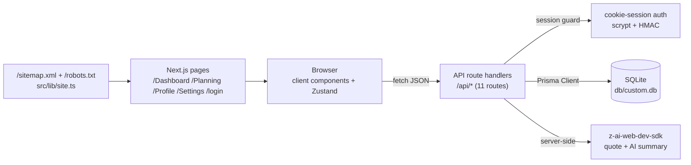

# FlowSchedule — Weekly Schedule Planner with AI Insights


A production-grade, self-hosted clone of the FlowSchedule reference app — a
weekly schedule planner with a dynamic time-grid calendar, AI-powered daily
insights, a focus timer, activity logging, and quick-capture notes. Every
view, route, and interaction mirrors the reference; the platform lock-in
(base44) is replaced with cookie-session auth, Prisma/SQLite persistence,
and server-side LLM calls with deterministic fallbacks.

## Overview

FlowSchedule answers one question well: **what does my week look like, and
what should I focus on today?** The Dashboard renders a 16-hour weekly time
grid (07:00–22:00, Mon–Sun) with gradient task blocks positioned to the
minute, surrounded by a skills pie chart, a status card, an LLM-generated
daily quote, and an AI summary of the day's schedule. The Planning page
organizes the same week into day columns with task chips and per-day
statistics. Quick Actions swap their card for inline gradient panels — a
task quick-add, a working focus timer, an activity log, and a notes
brainstorm pad.

## Key Features

| Feature | Description |
|---------|-------------|
| 📅 **Weekly time-grid calendar** | 80px day-label column + 16 × 60px hour slots (07:00–22:00); task blocks are absolutely positioned at 1px/minute with category gradients (work=blue, personal=green, health=red, learning=purple, creative=pink, social=yellow, planning=indigo); clicking an empty cell opens the task dialog prefilled with that day+hour |
| 🗓 **Weekly Planning page** | Seven day cards (top-3 task chips + "+N more"), selected-day task list, day statistics (scheduled hours, completed count, per-category bars), and an unscheduled backlog accordion |
| ⚡ **Quick Actions** | Four gradient tiles (reference hex stops: #0ea5e9→#2563eb, #10b981→#14b8a6, #8b5cf6→#6366f1, #f59e0b→#f97316) that swap the card body for inline panels: Add New Task, Start Focus Timer (live countdown), Log Activity (mark past tasks done), Quick Brainstorm (notes CRUD) |
| 🧠 **AI Summary card** | Server-side LLM analysis of the day's schedule (mood, focus areas, activity types, insight) with the reference's exact prompt and JSON schema; deterministic fallbacks on any failure |
| ☀️ **Daily Focus card** | LLM-generated productivity quote + author + affirmation ("Generate a short inspirational quote… Return as JSON") with a canned default |
| 🎯 **Skills Map** | Recharts pie of the day's scheduled minutes by category with an integer-hours center total and a per-category legend |
| 📶 **Status card** | "All caught up!" empty state or the next upcoming task with its date |
| ✅ **Task lifecycle** | 4 priorities (low/medium/high/urgent), 7 categories, 3 statuses (todo/in_progress/completed); create/edit/delete through a shadcn Dialog with datetime-local start + 15-minute-step duration |
| 🔐 **Cookie-session auth** | scrypt password hashing + HMAC-signed session tokens (HttpOnly cookie), per-IP login/register rate limiting (429 + Retry-After), sign-up built in |
| 📱 **Mobile navigation** | The reference's exact pattern: a ghost user-icon button opening a Radix DropdownMenu aligned `end` — menu right edge anchored to the trigger's right edge (measured parity: right 374 = trigger 374 @ 390px viewport); no bottom tab bar (the reference ships an empty nav-items array) |
| 🧪 **Test pyramid** | 44 Vitest unit tests (auth crypto, domain constants, db-path resolution, .env.example contract, site URL helper) + 29 Playwright e2e tests (mobile menu geometry parity, auth flows, dashboard, planning) + curl smoke checks |

## Screenshots

| Login | Dashboard |
|---|---|
|  |  |

| Planning | Mobile menu |
|---|---|
|  |  |

More captures in [`docs/screenshots/`](docs/screenshots/) (profile, settings,
focus timer, mobile dashboard, mobile planning).

## Tech Stack

| Layer | Technology | Version | Purpose |
|---|---|---|---|
| Framework | Next.js (App Router, Turbopack) | 16.x | Routes, RSC shell, API route handlers |
| UI runtime | React | 19.x | Client components |
| Language | TypeScript | 5.x strict | Typesafety across the stack |
| Styling | Tailwind CSS | 4.x (CSS-first `@theme`) | All styling; v3-era token values pinned (see Design System) |
| Components | shadcn-style on Radix | — | Dialog, Select, DropdownMenu, Accordion primitives |
| Charts | recharts | 3.x | Skills Map pie |
| Motion | framer-motion | 14.x | Animated background blobs (reference timings) |
| State | Zustand | 5.x | Client store: tasks/notes/user + API envelope unwrapping |
| Icons | lucide-react | 0.5.x | Icon set |
| ORM | Prisma | 6.x | User/Task/Note models |
| Database | SQLite | — | Zero-config local persistence (swap to PostgreSQL via `DATABASE_URL`) |
| AI | z-ai-web-dev-sdk | 0.0.x | Server-side LLM (daily focus + AI summary) |
| Tests | Vitest + Playwright | 5.x / 1.6.x | Unit + e2e |
| Runtime | Bun (or Node ≥ 20) | — | Dev server, scripts, TS execution |

## Architecture



All data flows through the Zustand store, which fetches typed JSON from the
API routes and unwraps the `{ ok, data } | { ok, error }` envelope. The
`/Dashboard`, `/Planning`, `/Profile`, `/Settings` routes live inside a
shared `(app)` layout that renders the gradient canvas, the animated
blobs, and the header (desktop avatar dropdown + the mobile user-icon
menu). `/login` is a standalone route with the auth card.

## File Hierarchy

```
📂 flow-schedule/
├── 📂 docs/
│   ├── 📂 screenshots/            # Dev-server captures (login → mobile planning)
│   ├── Tailwind-V4-Validation-Report.md  # The 5 engine traps this codebase pins
│   ├── DEPLOYMENT.md              # Production deployment guide
│   ├── session_1.md               # The build session's narrative transcript (operator-authored)
│   ├── session_1-review.md        # Session-1 review & remediation record
│   ├── remediation-plan-session1.md      # The session-1 review plan + execution log
│   └── how-to-git-push-using-ssh-wrapper_SKILL.md
├── 📂 prisma/
│   ├── schema.prisma              # User / Task / Note models
│   └── seed.ts                    # Idempotent seed (demo user + 9 tasks + 2 notes)
├── 📂 src/
│   ├── 📂 app/
│   │   ├── 📂 api/                # 11 route handlers (auth, tasks, notes, ai, health)
│   │   ├── 📂 (app)/              # Authenticated group: Dashboard, Planning, Profile, Settings
│   │   ├── 📂 login/              # Auth card (Suspense-wrapped useSearchParams)
│   │   ├── layout.tsx             # Root layout + metadataBase
│   │   ├── page.tsx               # / → /Dashboard redirect
│   │   ├── sitemap.ts / robots.ts # /sitemap.xml + /robots.txt (src/lib/site.ts)
│   │   └── globals.css            # Tailwind v4 @theme + the 5 trap mitigations
│   ├── 📂 components/
│   │   ├── 📂 ui/                 # shadcn primitives (button, dialog, select, …)
│   │   ├── 📂 layout/             # AppShell, Header (the mobile menu), BackgroundBlobs
│   │   ├── 📂 dashboard/          # WeeklySchedule, QuickActions, SkillsMap, StatusCard, DailyFocus, AISummary
│   │   └── 📂 planning/           # TaskDialog
│   ├── 📂 lib/                    # auth, api envelope, domain constants, ai, db, db-path, site
│   └── 📂 store/                  # useFlowStore (Zustand)
├── 📂 tests/
│   ├── 📂 e2e/                    # Playwright: mobile-navigation, auth, dashboard, planning
│   ├── auth.test.ts               # scrypt + HMAC seams
│   ├── domain.test.ts             # Reference constants contract
│   ├── db-path.test.ts            # SQLite URL resolution seam
│   ├── env-example.test.ts        # .env.example contract
│   └── site.test.ts               # Site URL helper
├── 📄 AGENTS.md                   # Agent operating instructions
├── 📄 CLAUDE.md                   # Claude Code project conventions
├── 📄 Project_Architecture_Document.md  # Full engineering reference (ADRs, layers, traps)
└── 📄 flow-schedule_SKILL.md      # Distilled engineering skill (20 sections + appendices)
```

## Quick Start

```bash
# 1. Install dependencies
bun install

# 2. Configure environment
cp .env.example .env
# generate a session secret:
#   echo "AUTH_SECRET=$(openssl rand -hex 32)" >> .env

# 3. Create + seed the database
bun run db:push && bun run db:seed

# 4. Start the dev server
bun run dev
```

Demo credentials (from the seed): **demo@flowschedule.app / demo1234**

### Verify Setup

```bash
curl http://localhost:3000/api/health
# {"status":"ok","app":"flow-schedule","database":"up","ts":"…"}

bun run lint && bun run typecheck && bun run test
# ESLint clean · tsc clean · 44/44 unit tests

bun run build && bun run test:e2e
# Build succeeds · 29/29 e2e tests (production standalone on :3100)
```

### Production

```bash
bun run build
bun run start   # standalone server on :3000 (NODE_ENV=production)
```

See `docs/DEPLOYMENT.md` for the absolute-path database recommendation and
environment hardening notes.

## Environment Variables

| Variable | Required | Purpose |
|---|---|---|
| `DATABASE_URL` | yes | SQLite `file:` URL or PostgreSQL connection string. A relative `file:../db/custom.db` resolves against `prisma/schema.prisma` for the CLI **and** the runtime (see `src/lib/db-path.ts`). Production: use an absolute path. |
| `AUTH_SECRET` | prod | HMAC signing secret for session tokens. Generate with `openssl rand -hex 32`. Falls back to a dev-only constant (loud comment, not silent). |
| `NEXT_PUBLIC_SITE_URL` | no | Canonical public origin — feeds `metadataBase`, `/sitemap.xml` and `/robots.txt` via `src/lib/site.ts`; falls back to `http://localhost:3000`. |

## API Reference

| Endpoint | Method | Auth | Description |
|---|---|---|---|
| `/api/auth/login` | POST | — | Email + password → session cookie (rate-limited) |
| `/api/auth/register` | POST | — | Create account + session (rate-limited) |
| `/api/auth/me` | GET | cookie | `{ user } \| { user: null }` |
| `/api/logout` | POST | cookie | Clears the session |
| `/api/tasks` | GET / POST | cookie | List tasks · create task (enum-invalid values coerce to the reference's defaults; stored enums are always valid) |
| `/api/tasks/[id]` | PATCH / DELETE | cookie | Update (partial, enum-guarded) · delete (ownership-checked) |
| `/api/notes` | GET / POST | cookie | List notes · create note (tags array) |
| `/api/notes/[id]` | PATCH / DELETE | cookie | Update · delete (ownership-checked) |
| `/api/ai/daily-focus` | GET | cookie | LLM quote/author/affirmation (fallback: Paul J. Meyer default) |
| `/api/ai/summary?date=` | GET | cookie | LLM mood/focus-areas/activities/insights (fallbacks per reference) |
| `/api/health` | GET | — | Liveness + DB probe |

All authenticated endpoints return the `{ ok, data } | { ok, error }`
envelope; the store surfaces `error.message` inline in the UI.

## Design System

Tailwind CSS **v4 CSS-first** — no `tailwind.config.*`; all tokens live in
`src/app/globals.css` under `@theme inline` with the v3-era values **pinned**
(v4's defaults drift; see `docs/Tailwind-V4-Validation-Report.md`):

- **Canvas**: `bg-gradient-to-br from-slate-50 via-sky-100 to-indigo-100` with three drifting framer-motion blobs (sky/blue, indigo/purple, cyan/teal; 30/35/40s mirrored loops)
- **Glass cards**: `bg-white/60 backdrop-blur-xl rounded-3xl shadow-xl border border-white/20`
- **Header**: `sticky top-0 z-50 bg-white/60 backdrop-blur-lg shadow-sm` — `--shadow-sm` pinned to the v3 value `0 1px 2px 0 rgb(0 0 0 / 0.05)` (Trap 5)
- **Category gradients**: `bg-gradient-to-r` pairs per category; Quick Action tiles carry the reference's literal hex gradient stops inline (Trap 3)
- **Buttons**: rounded-2xl pills; primary = `bg-gradient-to-r from-sky-500 to-blue-600`
- **Menu**: Radix DropdownMenu, `w-48 bg-white/90 backdrop-blur-md rounded-xl`, destructive Logout in `text-red-600`

## Testing

| Suite | Command | What it covers |
|---|---|---|
| Unit | `bun run test` | scrypt/HMAC round-trips, reference domain constants (16 slots, 80/60px, enums, gradients), db-path resolution, .env.example contract, site URL helper |
| E2E | `bun run test:e2e` | Mobile menu geometry parity (right-anchored, reference measurements), menu navigation, Escape/focus behavior, logout, login/register/error flows, dashboard calendar + task blocks + gradients, quick action panels, planning week cards + dialog flow |

The e2e suite boots the **production standalone build** on `:3100` with its
own seeded `db/e2e.db`; one setup project signs the demo user in once
(login is rate-limited, so per-test logins would trip the limiter).

## Troubleshooting

| Symptom | Cause | Fix |
|---|---|---|
| Styles "flat"/unstyled in prod | `@theme` var() chains dropped (Tailwind v4 build behavior) | Keep semantic tokens as literal `hsl()` values in `globals.css` (already done — don't refactor to var() chains) |
| Menu won't open via synthetic `.click()` in tests | Radix needs real pointer events | Use Playwright's `click()` (dispatches trusted events); never `el.click()` in `page.evaluate` |
| Trigger not found by role queries while menu open | Radix hide-others marks the app root `aria-hidden` | Query the trigger before opening (see `mobile-navigation.spec.ts`) |
| `Error occurred prerendering page "/login"` | `useSearchParams` without Suspense | The page shell wraps `LoginCard` in `React.Suspense` (already done) |
| Dev page unhydrated / native form GET fallbacks | Next 16 dev-origin protection blocks `127.0.0.1` chunks | `allowedDevOrigins: ["127.0.0.1", "localhost"]` in `next.config.ts` (already set) |
| Database at the wrong path | relative `file:` URL + different CWDs | `src/lib/db-path.ts` anchors to the schema's repo root for CLI, build, and server alike |

## License

MIT — see the repository license file.
