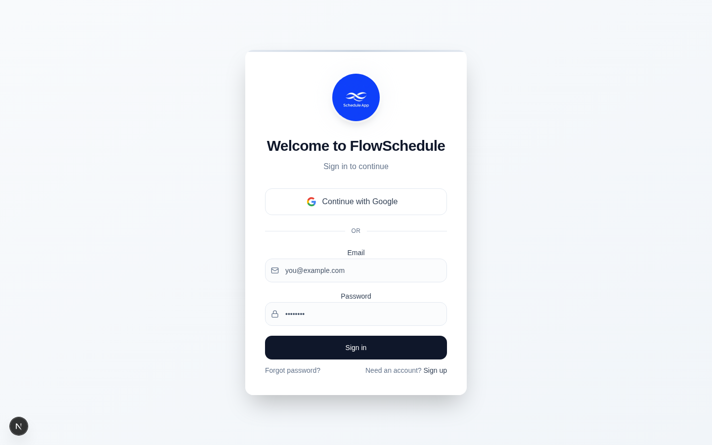
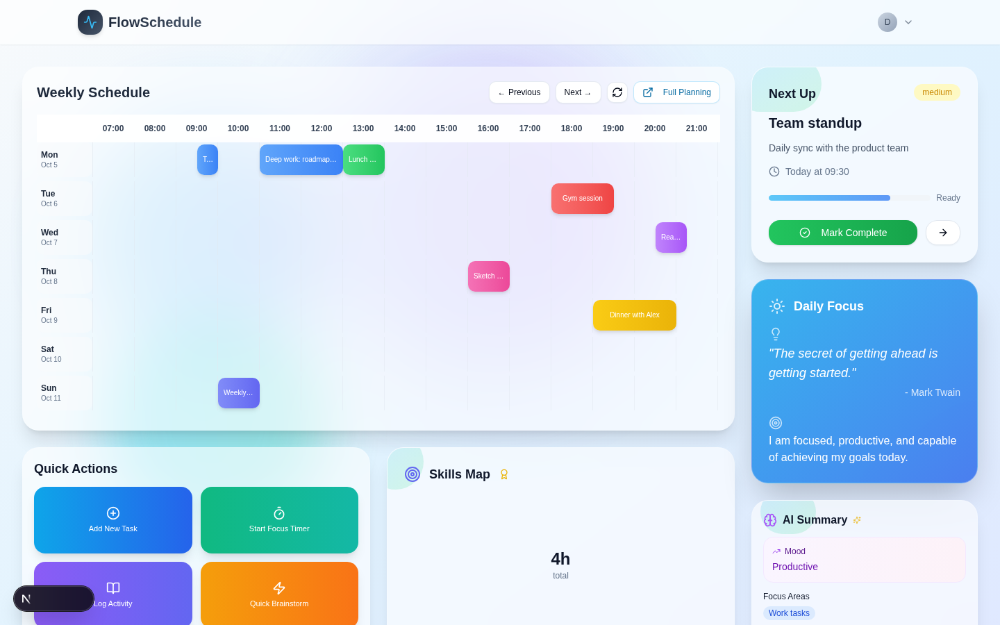
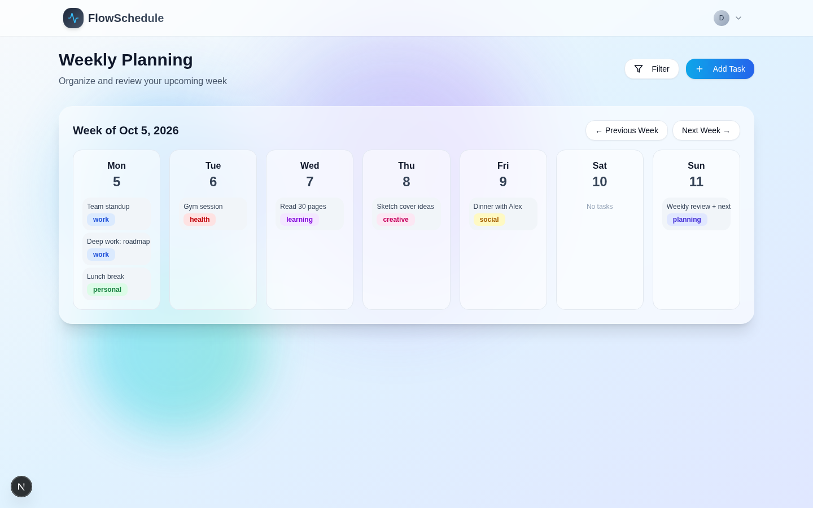
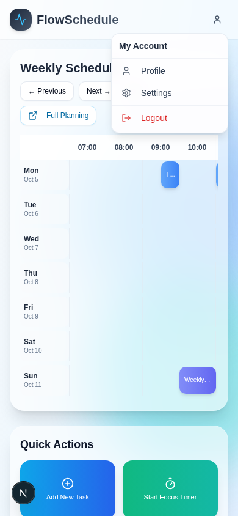
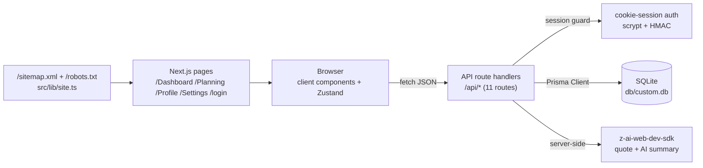

# FlowSchedule — Weekly Schedule Planner with AI Insights


A production-grade, self-hosted clone of the FlowSchedule reference app — a
weekly schedule planner with a dynamic time-grid calendar, AI-powered daily
insights, a focus timer, activity logging, and quick-capture notes. Every
view, route, and interaction mirrors the reference; the platform lock-in
(base44) is replaced with cookie-session auth, Prisma/SQLite persistence,
and server-side LLM calls with deterministic fallbacks.

## Overview

FlowSchedule answers one question well: **what does my week look like, and
what should I focus on today?** The Dashboard renders a 16-hour weekly time
grid (07:00–22:00, Mon–Sun) with gradient task blocks positioned to the
minute, surrounded by a skills pie chart, a status card, an LLM-generated
daily quote, and an AI summary of the day's schedule. The Planning page
organizes the same week into day columns with task chips and per-day
statistics. Quick Actions swap their card for inline gradient panels — a
task quick-add, a working focus timer, an activity log, and a notes
brainstorm pad.

## Key Features

| Feature | Description |
|---------|-------------|
| 📅 **Weekly time-grid calendar** | 80px day-label column + 16 × 60px hour slots (07:00–22:00) with reference-spaced day rows (`space-y-1.5`); task blocks are absolutely positioned at 1px/minute with category gradients (work=blue, personal=green, health=red, learning=purple, creative=pink, social=yellow, planning=indigo) and stacked by start-minute; clicking an empty cell opens the task dialog prefilled with that day+hour |
| 🗓 **Weekly Planning page** | Seven day cards (top-3 task chips + "+N more") whose order and chip selection follow the reference's **createdAt-desc task list** (newest first — the chips a user sees behind "+N more" are decided by array order, live-verified); clicking a card — chips included — selects the day (the reference's exact behavior: no section renders until a day is clicked, the highlight follows the selection, and there is no today-marker); the selected-day task list and the Day Statistics card (the reference's static placeholder) render as **always-visible Cards** — CardHeader/CardTitle (a div, not a heading)/CardContent, no accordion (the reference's decompiled structure) — behind the click; the category chips and task items render the reference's **classic shadcn DIV badges** (focus-ring + shadow/hover variant classes); the header's Filter/Add Task buttons carry the reference's `mr-2` icon margins and the Add Task button has no hover-gradient shift; the Filter button is decorative, exactly like the reference's |
| ⚡ **Quick Actions** | Four gradient tiles (reference hex stops: #0ea5e9→#2563eb, #10b981→#14b8a6, #8b5cf6→#6366f1, #f59e0b→#f97316) — decompiled panel behavior (session 3): opening a tile morphs the whole card into that action's gradient (motion expanding overlay from the clicked tile) and REPLACES the “Quick Actions” heading with the panel header; Add New Task (placeholder-only input, slate-700 submit), Start Focus Timer (live countdown, minutes input hidden while running, Play/Pause toggle, completion alert), Log Activity (read-only top-5 completed/past history with relative end times), Quick Brainstorm (notes with truncated previews, create/edit, confirm-delete) |
| 🧠 **AI Summary card** | Server-side LLM analysis of the day's schedule (mood, focus areas, activity types, insight) with the reference's exact prompt — **byte-for-byte, pinned to the CAPTURED InvokeLLM request body (session 13): the 8-space indented "blank" lines, the per-task template + join, the trailing space on item 3, and the createdAt-desc task order** — and JSON schema; Brain header icon + a Sparkles live indicator; deterministic fallbacks on any failure |
| ☀️ **Daily Focus card** | LLM-generated productivity quote + author + affirmation ("Generate a short inspirational quote… Return as JSON") with the reference's Mark Twain fallback; re-fetches on task mutations |
| 🎯 **Skills Map** | Recharts pie of the day's scheduled minutes by category with an integer-hours center total, a custom glass tooltip ("Xh Ym" / "Z% of day"), an Award live indicator, and a per-category legend with the reference's exact slice hexes |
| 📶 **Status card** | The reference's decompiled state machine (session 4): a loading skeleton, the rich "Next Up" card — priority badge, title, description, relative time ("Today at HH:mm" … including the reference's own date-fns format-string bug, mirrored), a 75% progress bar + "Ready", a **functional Mark Complete** button (PATCH → completed → card re-renders) and a decorative outline button — or the raw-icon "All caught up!" empty state |
| ✅ **Task lifecycle** | 4 priorities (low/medium/high/urgent), 7 categories, 3 statuses (todo/in_progress/completed); create/edit/delete through a shadcn Dialog (datetime-local start + 15-minute-step duration, "Create Task"/"Update Task" submit with a Save icon, "Are you sure…" delete confirmation) |
| 🔐 **Cookie-session auth** | scrypt password hashing + HMAC-signed session tokens (HttpOnly cookie), per-IP login/register rate limiting (429 + Retry-After), sign-up built in | 
| 🔒 **Route guards + 404** | The (app) routes are session-guarded server-side — unauthenticated visits redirect to `/login` exactly like the reference; the authenticated root `/` renders the Dashboard directly (the reference's post-login landing), and unknown paths render the reference's custom 404 (text-7xl slate numeral, echoed path, "Go Home") |
| 📱 **Mobile navigation** | The reference's exact pattern: a ghost user-icon button opening a Radix DropdownMenu aligned `end` — menu right edge anchored to the trigger's right edge (measured parity: right 374 = trigger 374 @ 390px viewport); no bottom tab bar (the reference ships an empty nav-items array) |
| 🧪 **Test pyramid** | 102 Vitest unit tests (auth crypto, domain constants incl. the skills color map, AI fallback content contract, db-path v3 incl. the repo-.env authority rule, .env.example contract, site URL helper, next.config contract, rate-limit fixed window + eviction, the wire-format serializer contract — **pinned to the CAPTURED live reference wire (session 12): created_date/updated_date/is_sample/created_by, 14-key Task / 9-key Note shapes**, the prisma-CLI wrapper contract, **the AI prompt wire (session 13): both InvokeLLM prompts pinned byte-for-byte against the captured request bodies + mocked-SDK wiring pins + the summary route's createdAt-desc order**, **the seed's sample-week re-anchoring (session 13, E-1)**) + 67 Playwright e2e tests (mobile menu geometry parity — **animation-settled**, auth flows — incl. the reference's separate sign-up / forgot-password views and the alert cards, route guards, the custom 404, dashboard — incl. the decompiled Quick Actions open-panel states AND the decompiled sidebar-card states: the Next Up card with a functional Mark Complete (state-transition-safe), the content-sized Refresh button, the skills-map legend/tooltip + the **recharts 2.x DOM-shape pin**, the AI cards' icons and chips — planning incl. its decompiled reference behaviors: the always-visible Card structure, the header icon margins, the "Create Task" dialog submit — **with its request-body interception pin (end_time client-computed + verbatim description, session 12 W-3/W-4)**, the createdAt-desc chips/list order, the classic DIV badges, **the reference's plain-DIV day cards (session 9, F-2)**, the new-task-first store semantics — **the enter-animation pin (tw-animate-css), the classic DialogTitle/SelectTrigger classes, the single lucide-trash2 class, the snake_case API response shape pinned to the captured 14-key wire, the strict formatDistanceToNowStrict relative times (session 10, F-2), the zero-data-slot DOM contract (session 10, F-1)**, **the Log Activity top-5 slice pin with >5 cross-week items (session 11, G-1), the Brainstorm empty-save no-op + newest-first multi-note order (session 11, G-2/G-3)**, the full-bleed dashboard container, the task-dialog delete confirmation) + curl smoke checks |

## Screenshots

| Login | Dashboard |
|---|---|
|  |  |

| Planning | Mobile menu |
|---|---|
|  |  |

More captures in [`docs/screenshots/`](docs/screenshots/) (profile, settings, focus timer, quick-action open panels, the Next Up status card, the task dialog, the sign-up / forgot-password / reset-sent views, the 404 page, mobile dashboard, mobile planning, mobile menu, mobile login).

## Tech Stack

| Layer | Technology | Version | Purpose |
|---|---|---|---|
| Framework | Next.js (App Router, Turbopack) | 16.x | Routes, RSC shell, API route handlers |
| UI runtime | React | 19.x | Client components |
| Language | TypeScript | 5.x strict | Typesafety across the stack |
| Styling | Tailwind CSS | 4.x (CSS-first `@theme`) | All styling; v3-era token values pinned (see Design System) |
| Components | shadcn-style on Radix | — | Dialog, Select, DropdownMenu, Accordion primitives |
| Charts | recharts | 2.15.x | Skills Map pie (the reference's measured major — its bundle carries no `recharts-zIndex` DOM; a v3 bump changes the pie's internal DOM and is pinned against by an e2e spec) |
| Motion | framer-motion | 14.x | Animated background blobs (reference timings) |
| State | Zustand | 5.x | Client store: tasks/notes/user + API envelope unwrapping |
| Icons | lucide-react | 0.475.x | Icon set (the reference's measured version — its bundle banner says v0.475.0 and its factory emits ONE class per icon; 0.525+ emits dual classes for renamed icons like trash-2, pinned by an e2e spec) |
| ORM | Prisma | 6.x | User/Task/Note models |
| Database | SQLite | — | Zero-config local persistence (swap to PostgreSQL via `DATABASE_URL`) |
| AI | z-ai-web-dev-sdk | 0.0.x | Server-side LLM (daily focus + AI summary) |
| Tests | Vitest + Playwright | 5.x / 1.6.x | Unit + e2e |
| Runtime | Bun (or Node ≥ 20) | — | Dev server, scripts, TS execution |

## Architecture



All data flows through the Zustand store, which fetches typed JSON from the
API routes and unwraps the `{ ok, data } | { ok, error }` envelope. The
`/Dashboard`, `/Planning`, `/Profile`, `/Settings` routes live inside a
shared `(app)` layout that renders the gradient canvas, the animated
blobs, and the header (desktop avatar dropdown + the mobile user-icon
menu). `/login` is a standalone route with the auth card.

## File Hierarchy

```
📂 flow-schedule/
├── 📂 docs/
│   ├── 📂 screenshots/            # Dev-server captures (login → mobile planning)
│   ├── Tailwind-V4-Validation-Report.md  # The 5 engine traps this codebase pins
│   ├── DEPLOYMENT.md              # Production deployment guide
│   ├── session_1.md               # The build session's narrative transcript (operator-authored)
│   ├── session_1-review.md        # Session-1 review & remediation record
│   ├── session_2.md               # The session-1 remediation narrative (operator-authored)
│   ├── session_2-review.md        # Session-2 review & remediation record
│   ├── remediation-plan-session1.md      # The session-1 review plan + execution log
│   ├── remediation-plan-session2.md      # The session-2 review plan + execution log
│   └── how-to-git-push-using-ssh-wrapper_SKILL.md
├── 📂 prisma/
│   ├── schema.prisma              # User / Task / Note models
│   └── seed.ts                    # Idempotent seed (demo user + 9 tasks + 2 notes)
├── 📂 src/
│   ├── 📂 app/
│   │   ├── 📂 api/                # 11 route handlers (auth, tasks, notes, ai, health)
│   │   ├── 📂 (app)/              # Session-guarded group: / (dashboard root), Dashboard, Planning, Profile, Settings
│   │   ├── 📂 login/              # Auth views — sign-in / sign-up / forgot-password (Suspense-wrapped useSearchParams)
│   │   ├── layout.tsx             # Root layout + metadataBase
│   │   ├── not-found.tsx          # The reference's custom 404 (session 5)
│   │   ├── sitemap.ts / robots.ts # /sitemap.xml + /robots.txt (src/lib/site.ts)
│   │   └── globals.css            # Tailwind v4 @theme + the 5 trap mitigations
│   ├── 📂 components/
│   │   ├── 📂 ui/                 # shadcn primitives (button, dialog, select, …)
│   │   ├── 📂 layout/             # AppShell, Header (the mobile menu), BackgroundBlobs
│   │   ├── 📂 dashboard/          # WeeklySchedule, QuickActions, SkillsMap, StatusCard, DailyFocus, AISummary, DashboardView (the / + /Dashboard island)
│   │   └── 📂 planning/           # TaskDialog
│   ├── 📂 lib/                    # auth, api envelope, domain constants, ai + ai-defaults (shared fallbacks), db, db-path, site
│   └── 📂 store/                  # useFlowStore (Zustand; taskVersion refresh counter)
├── 📂 tests/
│   ├── 📂 e2e/                    # Playwright: mobile-navigation, auth, dashboard, planning
│   ├── ai-defaults.test.ts        # The reference's fallback content contract
│   ├── auth.test.ts               # scrypt + HMAC seams
│   ├── domain.test.ts             # Reference constants contract (incl. skills colors)
│   ├── db-path.test.ts            # SQLite URL resolution seam
│   ├── env-example.test.ts        # .env.example contract
│   └── site.test.ts               # Site URL helper
├── 📄 AGENTS.md                   # Agent operating instructions
├── 📄 CLAUDE.md                   # Claude Code project conventions
├── 📄 Project_Architecture_Document.md  # Full engineering reference (ADRs, layers, traps)
└── 📄 flow-schedule_SKILL.md      # Distilled engineering skill (20 sections + appendices)
```

## Quick Start

```bash
# 1. Install dependencies
bun install

# 2. Configure environment
cp .env.example .env
# generate a session secret:
#   echo "AUTH_SECRET=$(openssl rand -hex 32)" >> .env

# 3. Create + seed the database
bun run db:push && bun run db:seed

# 4. Start the dev server
bun run dev
```

Demo credentials (from the seed): **demo@flowschedule.app / demo1234**

### Verify Setup

```bash
curl http://localhost:3000/api/health
# {"status":"ok","app":"flow-schedule","database":"up","ts":"…"}

bun run lint && bun run typecheck && bun run test
# ESLint clean · tsc clean · 102/102 unit tests

bun run build && bun run test:e2e
# Build succeeds (type-checked by the build itself) · 67/67 e2e tests (production standalone on :3100)
```

### Production

```bash
bun run build
bun run start   # standalone server on :3000 (NODE_ENV=production)
```

See `docs/DEPLOYMENT.md` for the absolute-path database recommendation and
environment hardening notes.

## Environment Variables

| Variable | Required | Purpose |
|---|---|---|
| `DATABASE_URL` | yes | SQLite `file:` URL or PostgreSQL connection string. A relative `file:../db/custom.db` resolves against `prisma/schema.prisma` for the CLI **and** the runtime (see `src/lib/db-path.ts`). **The repo's own `.env` is authoritative (db-path v3)**: an ambient env var carrying a SQLite URL that resolves outside the repo is ignored (parent-workspace hijack protection); an ambient URL resolving inside the repo (the e2e `db/e2e.db`) or a non-SQLite URL (production PostgreSQL) still wins. Production: set an absolute path in `.env`, or unset `DATABASE_URL` there and use the env var. |
| `AUTH_SECRET` | prod | HMAC signing secret for session tokens. Generate with `openssl rand -hex 32`. Falls back to a dev-only constant (loud comment, not silent). |
| `NEXT_PUBLIC_SITE_URL` | no | Canonical public origin — feeds `metadataBase`, `/sitemap.xml` and `/robots.txt` via `src/lib/site.ts`; falls back to `http://localhost:3000`. |

## API Reference

| Endpoint | Method | Auth | Description |
|---|---|---|---|
| `/api/auth/login` | POST | — | Email + password → session cookie (rate-limited) |
| `/api/auth/register` | POST | — | Create account + session (rate-limited) |
| `/api/auth/me` | GET | cookie | `{ user } \| { user: null }` |
| `/api/logout` | POST | cookie | Clears the session |
| `/api/tasks` | GET / POST | cookie | List tasks · create task (enum-invalid values coerce to the reference's defaults; stored enums are always valid). Both directions speak the reference's CAPTURED entity shape (session 12 XHR capture): requests `start_time`/`duration_minutes`/`end_time` (the dialog submits end_time client-computed; the API also derives it from start+duration when absent), responses `start_time`/`end_time`/`duration_minutes`/`created_date`/`updated_date`/`is_sample`/`created_by`/`created_by_id` (`src/lib/serialize.ts`, unit + e2e pinned to the exact 14-key set) |
| `/api/tasks/[id]` | PATCH / DELETE | cookie | Update (partial, enum-guarded) · delete (ownership-checked); responses serialized the same way |
| `/api/notes` | GET / POST | cookie | List notes · create note (tags array on BOTH sides — the storage JSON string is unwrapped by `serializeNote`) |
| `/api/notes/[id]` | PATCH / DELETE | cookie | Update · delete (ownership-checked) |
| `/api/ai/daily-focus` | GET | cookie | LLM quote/author/affirmation with the CAPTURED reference prompt, byte-for-byte (fallback: the reference's Mark Twain set — `src/lib/ai-defaults.ts`, unit-pinned) |
| `/api/ai/summary?date=` | GET | cookie | LLM mood/focus-areas/activities/insights built from the CAPTURED reference prompt (byte-for-byte — `src/lib/ai-prompt.ts`, unit-pinned; tasks fed in fn.Task.list()'s createdAt-desc order) with fallbacks per reference |
| `/api/health` | GET | — | Liveness + DB probe |

All authenticated endpoints return the `{ ok, data } | { ok, error }`
envelope; the store surfaces `error.message` inline in the UI.

## Design System

Tailwind CSS **v4 CSS-first** — no `tailwind.config.*`; all tokens live in
`src/app/globals.css` under `@theme inline` with the v3-era values **pinned**
(v4's defaults drift; see `docs/Tailwind-V4-Validation-Report.md`):

- **Canvas**: `bg-gradient-to-br from-slate-50 via-sky-100 to-indigo-100` with three drifting framer-motion blobs (sky/blue, indigo/purple, cyan/teal; 30/35/40s mirrored loops)
- **Glass cards**: `bg-white/60 backdrop-blur-xl rounded-3xl shadow-xl border border-white/20`
- **Header**: `sticky top-0 z-50 bg-white/60 backdrop-blur-lg shadow-sm` — `--shadow-sm` pinned to the v3 value `0 1px 2px 0 rgb(0 0 0 / 0.05)` (Trap 5)
- **Category gradients**: `bg-gradient-to-r` pairs per category; Quick Action tiles carry the reference's literal hex gradient stops inline (Trap 3)
- **Buttons**: rounded-2xl pills; primary = `bg-gradient-to-r from-sky-500 to-blue-600`
- **Menu**: Radix DropdownMenu, `w-48 bg-white/90 backdrop-blur-md rounded-xl`, destructive Logout in `text-red-600`

## Testing

| Suite | Command | What it covers |
|---|---|---|
| Unit | `bun run test` | scrypt/HMAC round-trips, reference domain constants (16 slots, 80/60px, enums, gradients, skills color map + name transform), the AI fallback content contract (Mark Twain set), db-path v3 resolution (incl. the repo-.env authority rule: parent-workspace hijack protection, the e2e isolation override, the production provider override), .env.example contract, site URL helper, next.config contract (no build bypasses), rate-limit fixed window + bucket eviction, **the wire-format serializer contract pinned to the CAPTURED reference wire (created_date/updated_date, is_sample, created_by/created_by_id, tags as array, the 14/9-key shapes)**, the prisma-CLI wrapper contract (db:push/db:migrate/db:reset route through `scripts/prisma-cli.ts`) |
| E2E | `bun run test:e2e` | Mobile menu geometry parity (right-anchored, reference measurements, **settled after the enter animation**), menu navigation, Escape/focus behavior, logout, login/register/error flows, dashboard calendar + task blocks + gradients, quick action panels (container gradient morph, header replacement, placeholder-only quick-add, minutes-hidden countdown, zero-minutes disabled state, read-only history, notes create/edit/confirm-delete), the decompiled sidebar-card states (Next Up card + functional Mark Complete + priority badge + progress bar — state-transition- and hour-of-day-independent, skills-map Award/legend classes + the recharts 2.x DOM-shape pin (no zIndex layers / shape wrappers), AI cards' Brain/Sparkles icons + purple-pink Mood + blue/green chips + max-h-20 insights, DailyFocus vertical layout + Target icon), the content-sized Refresh Calendar button, the full-bleed dashboard container, the day-row spacing/cursor, the task-dialog delete confirmation + "Create Task"/"Update Task" submit with its Save icon, the new-task-first store semantics after a dialog create, **the dialog's enter animation (computed animation-name), the classic DialogTitle/SelectTrigger classes, the reference's single lucide-trash2 class, the snake_case API response shape**, planning week cards + dialog flow + the decompiled reference behaviors (null-init selectedDay, the always-visible Card structure with no accordion/heading, static Day Statistics placeholder, selected-day highlight, chip bubbling, decorative Filter with its mr-2 icon margin, no Unscheduled section, the createdAt-desc chips/list order, the classic DIV category badges) |

The e2e suite boots the **production standalone build** on `:3100` with its
own seeded `db/e2e.db`; one setup project signs the demo user in once
(login is rate-limited, so per-test logins would trip the limiter).

## Troubleshooting

| Symptom | Cause | Fix |
|---|---|---|
| Styles "flat"/unstyled in prod | `@theme` var() chains dropped (Tailwind v4 build behavior) | Keep semantic tokens as literal `hsl()` values in `globals.css` (already done — don't refactor to var() chains) |
| Menu won't open via synthetic `.click()` in tests | Radix needs real pointer events | Use Playwright's `click()` (dispatches trusted events); never `el.click()` in `page.evaluate` |
| Trigger not found by role queries while menu open | Radix hide-others marks the app root `aria-hidden` | Query the trigger before opening (see `mobile-navigation.spec.ts`) |
| `Error occurred prerendering page "/login"` | `useSearchParams` without Suspense | The page shell wraps `LoginCard` in `React.Suspense` (already done) |
| Dev page unhydrated / native form GET fallbacks | Next 16 dev-origin protection blocks `127.0.0.1` chunks | `allowedDevOrigins: ["127.0.0.1", "localhost"]` in `next.config.ts` (already set) |
| Database at the wrong path | relative `file:` URL + different CWDs | `src/lib/db-path.ts` anchors to the schema's repo root for CLI, build, and server alike |

## License

MIT — see the repository license file.
